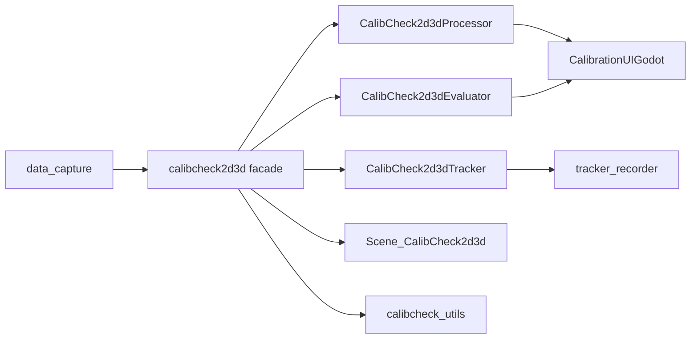
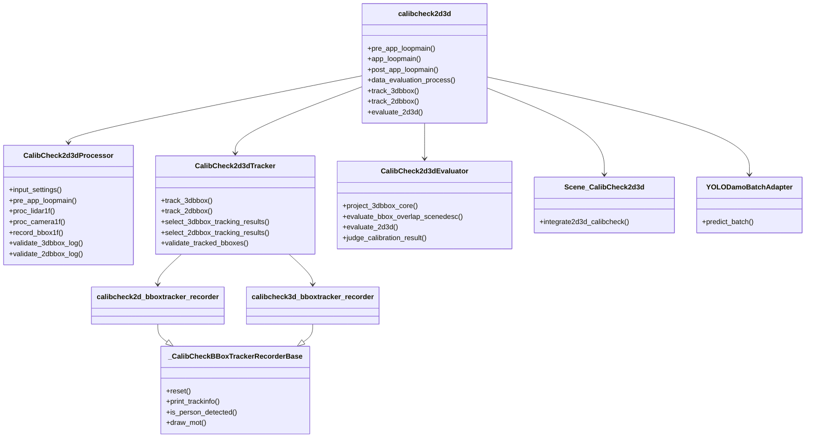
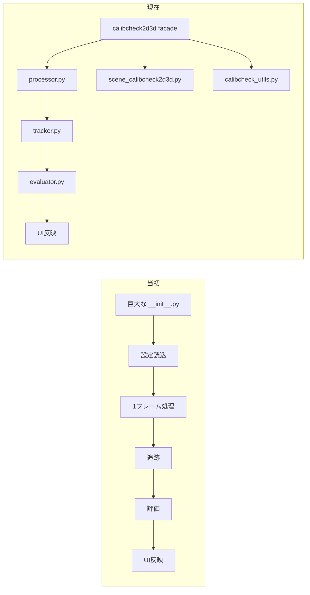
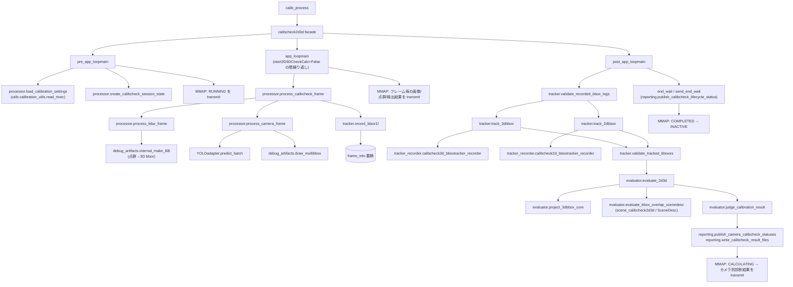
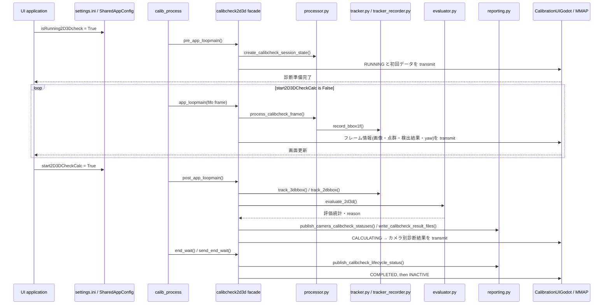
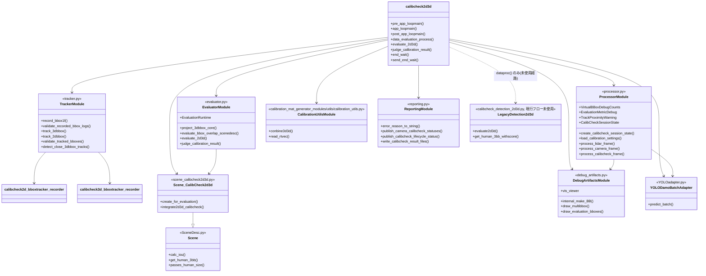

# calibcheck2d3d 旧新対比表とクラス図

## 1. 何が変わったか

結論として、**処理の大筋は同じ**ですが、**クラス構成と責務分割は大きく変わっています**。

### 対比表

| 観点 | 当初 | 現在 |
|---|---|---|
| 入口 | 巨大な `__init__.py` に処理が集中 | [__init__.py](D:/argus-3d-vision/app/core/argus_synchro/calibration_mat_generator_modules/ctrl/calibcheck2d3d/__init__.py) は facade |
| 初期化 | 設定・依存生成・処理本体が混在 | facade が各 helper を組み立てる |
| 1フレーム処理 | `__init__.py` 内で直接実行 | [processor.py](D:/argus-3d-vision/app/core/argus_synchro/calibration_mat_generator_modules/ctrl/calibcheck2d3d/processor.py) へ委譲 |
| LiDAR処理 | 点群前処理、bbox化、UI反映が同居 | processor が担当 |
| Camera処理 | 画像補正、YOLO、描画、UI反映が同居 | processor が担当 |
| 追跡 | 2D/3D の追跡・選別・妥当性判定が混在 | [tracker.py](D:/argus-3d-vision/app/core/argus_synchro/calibration_mat_generator_modules/ctrl/calibcheck2d3d/tracker.py) に分離 |
| 評価 | 投影、重なり評価、仮想 bbox、判定が混在 | [evaluator.py](D:/argus-3d-vision/app/core/argus_synchro/calibration_mat_generator_modules/ctrl/calibcheck2d3d/evaluator.py) に分離 |
| Scene判定 | `SceneDesc.py` と本体が密結合 | [scene_calibcheck2d3d.py](D:/argus-3d-vision/app/core/argus_synchro/calibration_mat_generator_modules/ctrl/calibcheck2d3d/scene_calibcheck2d3d.py) へ切り出し |
| デバッグ補助 | 描画・点群・rtvec が散在 | [calibcheck_utils.py](D:/argus-3d-vision/app/core/argus_synchro/calibration_mat_generator_modules/ctrl/calibcheck2d3d/calibcheck_utils.py) に集約 |
| 追跡記録 | 2D/3D recorder が別々に重複 | [tracker_recorder.py](D:/argus-3d-vision/app/core/argus_synchro/calibration_mat_generator_modules/ctrl/calibcheck2d3d/tracker_recorder.py) で共通基底化 |
| UI反映 | 直接呼び出しが多い | processor が集約して扱う |
| エラー・診断 | 本体に直書き | `diagnosis` / `shared_errors` に寄せて保持 |

## 2. 現在の処理フロー

## 3. クラス図

## 4. 見方

- 旧構成は「`__init__.py` に全部入っている」形
- 現構成は「入口 + helper 群」の形
- そのため、**処理順は似ていても、クラスの役割分担は別物** と見てよい

## 5. 旧新の並列表現

| 処理段階 | 当初 | 現在 |
|---|---|---|
| 起動 | `calibcheck2d3d.__init__` が初期化と処理を兼ねる | `calibcheck2d3d` facade が各 helper を組み立てる |
| 設定読込 | 本体内で直接実施 | [processor.py](D:/argus-3d-vision/app/core/argus_synchro/calibration_mat_generator_modules/ctrl/calibcheck2d3d/processor.py) の `input_settings()` |
| 1フレーム入力診断 | 本体内で直接実施 | [processor.py](D:/argus-3d-vision/app/core/argus_synchro/calibration_mat_generator_modules/ctrl/calibcheck2d3d/processor.py) |
| LiDAR処理 | 点群整形・静止点除去・bbox生成・UI反映を直書き | [processor.py](D:/argus-3d-vision/app/core/argus_synchro/calibration_mat_generator_modules/ctrl/calibcheck2d3d/processor.py) |
| Camera処理 | 歪み補正・YOLO・描画・UI反映を直書き | [processor.py](D:/argus-3d-vision/app/core/argus_synchro/calibration_mat_generator_modules/ctrl/calibcheck2d3d/processor.py) |
| bbox記録 | 本体内でフレーム蓄積 | [processor.py](D:/argus-3d-vision/app/core/argus_synchro/calibration_mat_generator_modules/ctrl/calibcheck2d3d/processor.py) の `record_bbox1f()` |
| 2D/3D追跡 | 本体内で追跡・選別・妥当性判定 | [tracker.py](D:/argus-3d-vision/app/core/argus_synchro/calibration_mat_generator_modules/ctrl/calibcheck2d3d/tracker.py) |
| 3D-2D評価 | 本体内で投影・仮想bbox・重なり評価・判定 | [evaluator.py](D:/argus-3d-vision/app/core/argus_synchro/calibration_mat_generator_modules/ctrl/calibcheck2d3d/evaluator.py) |
| Scene判定 | 本体と密結合 | [scene_calibcheck2d3d.py](D:/argus-3d-vision/app/core/argus_synchro/calibration_mat_generator_modules/ctrl/calibcheck2d3d/scene_calibcheck2d3d.py) |
| デバッグ補助 | 描画・点群・rtvec が散在 | [calibcheck_utils.py](D:/argus-3d-vision/app/core/argus_synchro/calibration_mat_generator_modules/ctrl/calibcheck2d3d/calibcheck_utils.py) |
| 終了時評価 | 本体内で追跡→評価→判定→UI反映 | `__init__.py` が各 helper を順に呼び出し、結果を UI へ反映 |

### 横並びの見え方

必要なら次に、この対比表を [calibcheck2d3d_current_flow.md](D:/argus-3d-vision/app/core/docs/calibcheck2d3d_current_flow.md) へリンクして、文書群を一本化できます。

## 6. 最終構成（2026-09-18時点）

第一次リファクタリング完了後の実装（`lifecycle.py`/`reason_codes.py`/`result_artifacts.py`
を `reporting.py` へ統合、`types.py` を `processor.py` へ統合、`debuginfo_and_functions.py`
を `debug_artifacts.py`/`calibration_utils.py` へ分割した状態）を反映する。
`calibration_utils.py` はその後 `wait_app` とも共用する汎用モジュールであるため、
`calibcheck2d3d` 配下から `calibration_mat_generator_modules/utils/` へ移設した。

### 6.1 ファイル構成（11ファイル、`calibration_utils.py` は上位の `utils/` に移設済み）

| ファイル | 責務 |
|---|---|
| `__init__.py` | facade。`pre_app_loopmain`/`app_loopmain`/`post_app_loopmain` などUI・設定ファイルとの外部プロトコルを担う |
| `processor.py` | 1フレーム処理（LiDAR/カメラ）、セッション状態、`VirtualBBoxDebugCounts`等のデバッグ用型定義 |
| `tracker.py` | bbox記録、ログ検証、2D/3D追跡のオーケストレーション |
| `tracker_recorder.py` | `calibcheck2d_bboxtracker_recorder` / `calibcheck3d_bboxtracker_recorder`（SORTベースの実追跡） |
| `evaluator.py` | 3D→2D投影、重なり評価、判定、`EvaluationRuntime`、評価ループ中心 |
| `SceneDesc.py` | `Scene` 基底クラス、IOU計算、人サイズゲート |
| `scene_calibcheck2d3d.py` | `Scene_CalibCheck2d3d`（`Scene` を継承し、fisheyeカメラ内部パラメータを保持） |
| `debug_artifacts.py` | トレース、動画/pickle出力、bbox描画、`vis_viewer`（Open3D可視化） |
| `reporting.py` | reason変換、MMAPステータス公開、結果ファイル出力（旧 lifecycle/reason_codes/result_artifacts統合） |
| `YOLOadapter.py` | `YOLODamoBatchAdapter`。Detect2dDamoYoloOnnxのバッチ推論ラッパー |
| `calibcheck_detection_2d3d.py` | 旧アルゴリズム(`evaluate2d3d`等)。現行の `pre/app/post_app_loopmain` からは呼ばれず、未使用の `dataproc()` レガシーメソッドからのみ参照される |
| `calibration_mat_generator_modules/utils/calibration_utils.py`（上位モジュール） | LiDAR統合(`conbine3d3d`)、キャリブレーション行列読込(`read_rtvec`)。`calibcheck2d3d` と `wait_app` の双方が対等に参照する共通モジュール |

### 6.2 処理フロー

### 6.3 相互作用図（UI / MMAP を含む）

### 6.4 クラス図

### 6.5 補足

- `calibration_utils.py` は `calibcheck2d3d` 専用ではなく `wait_app` とも共用するため、
  パッケージ階層を1段上げて `calibration_mat_generator_modules/utils/` に配置している。
  これにより `wait_app` が `calibcheck2d3d` の内部モジュールを直接importするという
  不自然な依存方向を解消した。
- `calibcheck_detection_2d3d.py` は `pre_app_loopmain`/`app_loopmain`/`post_app_loopmain`
  のいずれからも呼ばれない。参照は未使用の `dataproc()` メソッド内のみで、実運用の校正診断
  フローには関与しない（削除・整理の候補だが、現時点では安全のため残置）。
- MMAPへの書き込みは引き続き `CalibrationUIGodot.transmit_setdata()` に集約されており、
  各モジュールは値を facade に返すのみで MMAP を直接操作しない。
- リファクタリング前後で `pre_app_loopmain`/`app_loopmain`/`post_app_loopmain` の外部シグネチャ・
  呼び出し回数・MMAP契約は変更していない（`docs/calibcheck2d3d_refactoring.md` の実測結果も参照）。
