# calibcheck2d3d 診断機構 設計資料

## 1. 目的

本資料は、2D-3D 校正要否チェック機能 `calibcheck2d3d` における診断処理の責務、
データ構造、呼び出し位置、および段階的な実装方針を定義する。

`calibcheck2d3d` は、既存のカメラ-LiDAR校正結果を使い、通常運用中に再校正の要否を
簡易確認する機能である。新しい校正パラメータを求める `calibration2d3d` とは用途と
実行単位が異なる。診断機構も `calibcheck2d3d` の運用を基準として設計する。

本設計の目的は次のとおりである。

- reason 1～11 の正式な定義を `diagnosis` パッケージへ集約する。
- データ処理と、不良状態を判定する診断処理を分離する。
- データ収集中にしか観測できない異常と、収集後の評価で判明する異常を同じ診断セッションに記録する。
- 内部の詳細な理由と、ユーザーへ通知する集約済みステータスを分離する。
- システム全体のエラー診断と、校正要否チェック固有の判定不能理由を混同しない。
- 診断条件を追加・調整しても、処理モジュールとUI出力への影響を限定できる構造にする。

## 2. 対象範囲

主な対象は次のファイルである。

| ファイル | 現在の役割 | 本設計での役割 |
| --- | --- | --- |
| `argus_synchro/diagnosis/calibcheck2d3d_result_diagnosis.py` | UIステータスと一部の変換規則 | reason、表示文言、集約規則、診断クラス、診断結果型の正式な定義元 |
| `calibration_mat_generator_modules/ctrl/calibcheck2d3d/reporting.py` | reasonの文言・UI番号、MMAP通知、ファイル出力 | 診断済み結果の通知とファイル出力のみ |
| `calibration_mat_generator_modules/ctrl/calibcheck2d3d/processor.py` | 1フレーム処理、入力検査 | 診断に必要な観測値を生成する処理 |
| `calibration_mat_generator_modules/ctrl/calibcheck2d3d/tracker.py` | bboxログ検査、追跡、reason生成 | bboxログ・追跡結果と診断用統計の生成 |
| `calibration_mat_generator_modules/ctrl/calibcheck2d3d/evaluator.py` | 投影、評価、統計、reason生成、全体制御 | 評価結果と診断用統計の生成 |
| `calibration_mat_generator_modules/ctrl/calibcheck2d3d/__init__.py` | facade、状態保持、ライフサイクル | 診断セッションの所有と各処理段階からの診断呼び出し |

## 3. 設計原則

### 3.1 診断モジュールを理由判定の唯一の定義元にする

reasonの数値、名前、表示文言、UIステータスへの集約規則は
`calibcheck2d3d_result_diagnosis.py` に置く。ほかのモジュールでは数値リテラルを使わない。

### 3.2 計算処理は観測値を返し、正式な診断結果を保持しない

`processor.py`、`tracker.py`、`evaluator.py` は、検出数、ログ件数、追跡数、評価スコアなどの
事実を返す。正式なfinding、代表理由、UI statusは診断クラスだけが保持する。
現行の`evaluator.py`は評価分岐と互換戻り値のためreason 10・11の候補値も返すが、
診断クラスへ同期・対応件数を渡し、正式なfindingとdetailsを生成する。

### 3.3 診断は処理段階の直後に呼ぶ

診断は `app_loopmain()` の先頭または末尾に一括して置くのではなく、必要な観測値が確定した
直後に呼ぶ。これにより、診断が未初期化データや後段で変換済みのデータに依存することを防ぐ。

### 3.4 詳細理由を保持したままUI向けに集約する

内部ではreason 1～11を保持する。UIへは `CameraCalibCheckStatus` に集約して通知する。
診断中に複数理由が見つかった場合は全理由を保存し、明示した優先規則で代表理由を選ぶ。

### 3.5 システムエラー診断と役割を分ける

`SharedErrors` はシステム全体の異常検出、状態共有、復旧判定、ログ出力を担当する。
`CalibCheck2d3dDiagnosis` は、そのセッションで校正要否を判定できるか、判定不能なら何が原因かを
記録する。同じ入力異常を別々の条件で再判定せず、システム診断の結果を観測値として受け取る。

### 3.6 診断理由以外の既存動作を維持する

本設計の導入で変更を許容するのは、reason 1～11の判定、記録、代表理由の選択、および
その理由に基づくUI向け診断ステータスである。それ以外は現在の実装を基準として維持する。

特に次の振る舞いを変更しない。

- `pre_app_loopmain()`、`app_loopmain()`、`post_app_loopmain()` の外部シグネチャと呼び出し回数
- `RUNNING`、`CALCULATING`、`COMPLETED`、`INACTIVE` のライフサイクルとMMAP送信順
- 1フレーム内の入力診断、yaw、LiDAR、カメラ、描画、bbox記録、debug出力、MMAP送信の順序
- FIFOデータ、画像、点群、bbox、追跡データの形式
- カメラ補正、YOLO、点群前処理、bbox生成、追跡、投影、対応付け、score計算のアルゴリズム
- 既存設定値の意味、既定値、および閾値
- reasonが0で評価が成立した場合の校正要否判定結果
- 既存の結果ファイル形式、MMAPレイアウト、カメラ番号の対応
- `calibration2d3d`、`calibration3d3d` およびシステム共通診断の期待値

構造変更の途中でも、計算処理の戻り値へreasonを追加するために既存値の型や意味を変更しない。
必要な診断情報は、専用の観測値を追加で返すか、互換ラッパーを介して診断クラスへ渡す。

reasonの判定結果が変わるテストについては、変更理由と新旧の期待値を明示する。単に構造を
移しただけの段階では、既存reasonも含めて結果を変更しない。

## 4. 診断理由

reasonは `IntEnum` として正式に定義する。

| 値 | 定義名案 | 意味 | 主な判定時点 | 適用範囲 |
| ---: | --- | --- | --- | --- |
| 0 | `NONE` | 不良理由なし | 最終結果生成 | カメラ別 |
| 1 | `SENSOR_DATA_INVALID` | FIFOまたはセンサ入力が欠損・破損しており読み取れない | フレーム処理前 | 全体またはカメラ別 |
| 2 | `BBOX3D_LOG_INVALID` | 3D bboxログの量または内容が評価条件を満たさない | 収集後 | 全カメラ共通 |
| 3 | `BBOX2D_LOG_INVALID` | 2D bboxログの量または内容が評価条件を満たさない | 収集後 | カメラ別 |
| 4 | `TRACKING3D_INVALID` | 有効な3D追跡対象がない、または異常に多いなど追跡結果が不正 | 収集後 | 全カメラ共通 |
| 5 | `TRACKING2D_INVALID` | 有効な2D追跡対象がない、または異常に多いなど追跡結果が不正 | 収集後 | カメラ別 |
| 6 | `EVALUATION_RESULT_INVALID` | 2D-3D評価結果が不正、欠損、非有限値など | 収集後 | カメラ別 |
| 7 | `EVALUATION_STATISTICS_INVALID` | 評価統計を計算できない、母数不足、統計値不正など | 収集後 | カメラ別 |
| 8 | `CALIBRATION_JUDGEMENT_INVALID` | 最終的な校正要否判定を確定できない | 収集後 | カメラ別 |
| 9 | `CAMERA_PERSON_NOT_DETECTED` | 規定観測時間を満たしてもカメラで人物を一度も検出できない | 収集終了時 | カメラ別 |
| 10 | `SENSOR_TIME_SYNC_INVALID` | カメラとLiDARの収集系列が対応しない | データ収集中または投影・対応評価後 | カメラ別 |
| 11 | `MATCHED_PERSON_NOT_DETECTED` | カメラとLiDARの双方で評価可能な同一人物の対応がない | 投影・対応評価後 | カメラ別 |

各理由の現在の判定式は第9～10節に示す。今後の閾値調整項目は第17節にまとめる。

## 5. UI向けステータス

詳細理由は、ユーザー向けには次のステータスへ集約する。

| UIステータス | 対応する詳細理由 |
| --- | --- |
| `CALIBRATION_NOT_REQUIRED` | reason 0、かつ評価結果が許容範囲 |
| `CALIBRATION_REQUIRED` | reason 0、かつ評価結果が許容範囲外 |
| `UNKNOWN_INSUFFICIENT_DATA` | reason 2、3、10 |
| `PERSON_NOT_DETECTED` | reason 9、11 |
| `POOR_PERSON_DETECTION` | reason 4、5 |
| `POOR_SENSOR_DATA` | reason 1 |
| `POOR_EVALUATION_RESULT` | reason 6、7、8 |

`FORBIDDEN` はMMAP上の予約・禁止値として扱い、通常の診断結果として書き込まない。

## 6. 診断データ型

### 6.1 診断フェーズ

```python
class CalibCheckDiagnosisPhase(Enum):
    FRAME_INPUT = auto()
    BBOX_LOG = auto()
    TRACKING = auto()
    EVALUATION = auto()
    STATISTICS = auto()
    JUDGEMENT = auto()
```

### 6.2 個別の検出結果

```python
@dataclass(frozen=True)
class CalibCheckFinding:
    reason: CalibCheckFailureReason
    camera_index: int | None
    phase: CalibCheckDiagnosisPhase
    message: str
    details: Mapping[str, object]
```

`camera_index=None` は、LiDAR入力や3D追跡など全カメラへ影響する問題を表す。
`details` はログやデバッグ出力に使い、UIプロトコルには直接公開しない。

### 6.3 カメラ別の最終結果

```python
@dataclass(frozen=True)
class CameraCalibCheckDiagnosisResult:
    camera_index: int
    status: CameraCalibCheckStatus
    primary_reason: CalibCheckFailureReason
    all_reasons: tuple[CalibCheckFailureReason, ...]
    calibration_is_acceptable: bool | None
```

`calibration_is_acceptable` は三値として扱う。

- `True`: 校正状態は許容範囲で、再校正不要
- `False`: 評価は成立したが校正状態が許容範囲外
- `None`: 評価が成立せず、校正要否を判定不能

## 7. 診断クラス

外部には処理段階単位のメソッドを公開する。現在の実装上の対応は次のとおりである。

```python
class CalibCheck2d3dDiagnosis:
    def reset(self, camera_count: int) -> None: ...

    def diagnose_frame(
        self, observation: CalibCheckFrameObservation
    ) -> None: ...                                    # reason 1/9/10

    def diagnose_person_detection(self) -> None: ...  # reason 9の終了時確定

    def diagnose_bbox_logs(
        self, observation: BBoxLogObservation
    ) -> tuple[bool, ...]: ...                        # reason 2/3

    def diagnose_tracking(
        self, observation: TrackingObservation
    ) -> tuple[bool, ...]: ...                        # reason 4/5

    def diagnose_evaluation(
        self, observation: EvaluationObservation
    ) -> None: ...                                    # reason 6/10/11

    def diagnose_statistics(
        self, observation: StatisticsObservation
    ) -> None: ...                                     # reason 7

    def diagnose_judgement(
        self, observation: JudgementObservation
    ) -> None: ...                                    # reason 8

    def finalize(
        self,
        calibration_results: Sequence[bool | None],
    ) -> list[CameraCalibCheckDiagnosisResult]: ...
```

公開メソッドを処理段階ごとに分け、各観測型の単体テストでreasonごとの境界条件を確認する。

## 8. クラス図

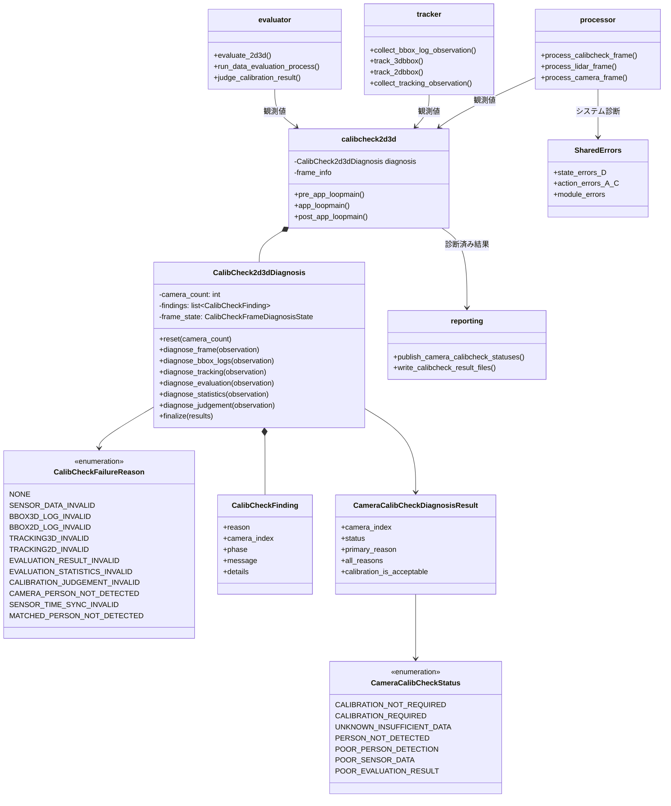

### 8.1 診断観測型のクラス図

処理モジュールは観測値を生成し、`CalibCheck2d3dDiagnosis`がreasonを判定する。評価段階では、
同じ評価ループからreason 6、7、10、11に必要な証跡を生成する。

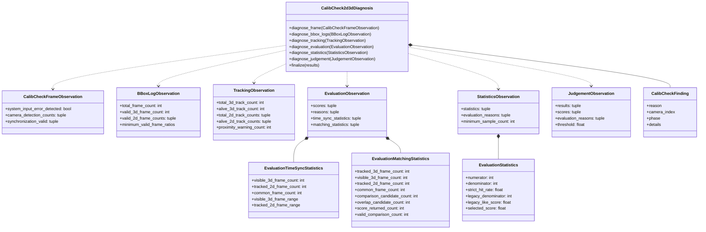

## 9. データ収集中の処理フロー

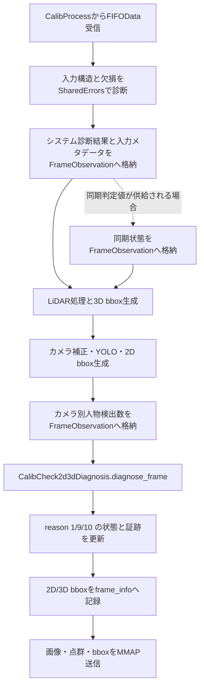

### 9.1 フレーム診断状態

reason 9と10は一時的な欠損だけで確定させず、セッション中の状態を評価する。そのため診断セッションは
少なくとも次を保持する。

- 総受信フレーム数
- 正常・異常入力フレーム数
- カメラ別の観測フレーム数、人物検出フレーム数、人物検出総数
- カメラ別の人物未検出連続フレーム数と最大値（診断詳細用）
- 単調増加時計によるカメラ観測開始・最終更新時点
- 同期不良の連続フレーム数と累積フレーム数
- 最後に正常入力・正常同期を得た経過時点またはフレーム番号

reason 9の経過時間には、システム時刻やセンサーの絶対時刻を使用しない。OSの単調増加時計を
使い、時刻補正や時刻の巻き戻りから診断結果を分離する。規定時間は
`person_not_detected_sec`で設定し、初期値を10秒とする。途中で一度でも人物を
検出したカメラはreason 9にしない。

ループ中に不良候補を記録しても、通常はその時点で最終UI結果を確定しない。処理継続が不可能な
入力異常は、従来どおりシステム診断と呼び出し元の制御に従ってフレームを棄却または終了する。

## 10. データ収集後の処理フロー

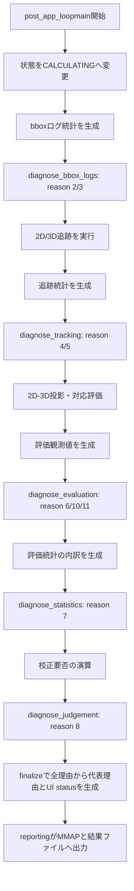

### 10.0.1 reasonのまとまりと処理段階

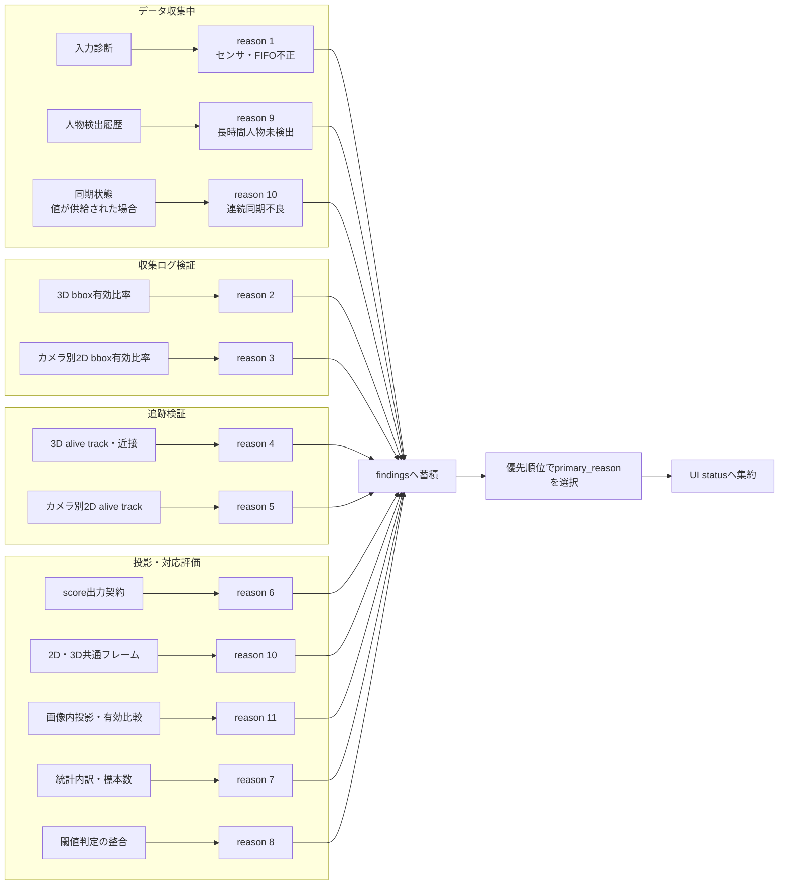

### 10.0.2 後段処理を継続する条件

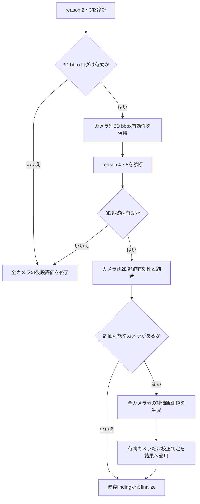

### 10.1 reason 2・3のbboxログ診断

`tracker.collect_bbox_log_observation()`はreasonを決めず、記録済みログを1回走査して次を集計する。

- 総記録フレーム数
- 規定数以上の3D bboxを含むフレーム数
- 規定数以上の2D人物bboxを含むフレーム数（カメラ別）
- 2D・3Dそれぞれの1フレーム当たり最小bbox数と最小有効フレーム比率

`CalibCheck2d3dDiagnosis.diagnose_bbox_logs()`が集計値から有効フレーム比率を計算し、
次の条件でreasonを確定する。

```text
3D有効フレーム比率 < thresh_3dbbox_count_mean_ratio
    → reason 2（全カメラ共通）

カメラ別2D有効フレーム比率 < thresh_2dbbox_count_mean_ratio
    → reason 3（該当カメラのみ）
```

有効フレームは、それぞれ次の条件を満たすフレームとする。

```text
3D bbox数 >= thresh_3dbbox_count_per_frame
2D人物bbox数 >= thresh_2dbbox_count_per_frame
```

総フレーム数が0の場合、3Dと全カメラの2Dを無効として記録する。閾値と比率が等しい場合は
有効とする。findingの`details`には総フレーム数、有効フレーム数、実際の比率、使用した
件数閾値と比率閾値を保存する。

3Dログが無効な場合は全カメラの後続評価を中止する。3Dログが有効で一部カメラの2Dログだけが
無効な場合は、有効なカメラについて追跡と2D-3D評価を継続する。

### 10.2 reason 4・5の追跡結果診断

`tracker.collect_tracking_observation()`は、従来の条件で3D・2D trackを選別した後、次を集計する。

- 選別前の3D track総数と、選別後のalive track数
- 選別前の2D track総数と、選別後のalive track数（カメラ別）
- 3D・2Dそれぞれの最小alive track数
- 3D track近接警告数と、近接警告を診断失敗として扱う設定

3D trackは、追跡期間、移動距離、作業領域内フレーム数の既存条件で選別する。2D trackは、
追跡期間と画像上の移動距離の既存条件で選別する。この選別処理はreasonを決定しない。

`CalibCheck2d3dDiagnosis.diagnose_tracking()`は次の条件でreasonを確定する。

```text
3D alive track数 < thresh_3dbbox_tracking_idcount
または
近接警告あり、かつ近接警告を失敗として扱う
    → reason 4（全カメラ共通）

カメラ別2D alive track数 < thresh_2dbbox_tracking_idcount
    → reason 5（該当カメラのみ）
```

findingの`details`には選別前track数、alive track数、最小alive track数を保存する。reason 4には
近接警告数と近接警告を失敗扱いする設定も保存する。正常時には追加の詳細ログを出さず、
reason 4または5が成立した場合だけdetailsをログへ出力する。

3D追跡が無効な場合は全カメラの後続評価を中止する。3D追跡が有効で一部カメラの2D追跡だけが
無効な場合は、有効なカメラについて2D-3D評価を継続する。

途中段階で全カメラが評価不能になった場合は、重い後段処理を省略してよい。ただし、すでに記録した
`CalibCheckFinding` は破棄せず、`finalize()` で結果へ反映する。

### 10.3 reason 6・7・8の評価・統計・判定診断

3つのreasonは、同じスコアを扱うが異なる処理段階を表す。

| reason | 診断対象 | 不良条件 |
|---:|---|---|
| 6 | 2D-3D評価の最終出力 | scoreが非数・無限、または0～1の範囲外 |
| 7 | scoreを生成した統計の内訳 | 選択中の評価式の標本不足、分子・分母の不整合、非有限値、選択scoreとの不一致 |
| 8 | 校正要否の閾値判定 | 閾値が0～1の範囲外、結果がboolでない、または `score >= threshold` と結果が不一致 |

reason 7では、`use_legacy_like_metric` に従って標本数を選ぶ。legacy式では
`legacy_denominator`、strict式では`denominator`を使用し、
`score_accept_count_threshold`以上であることを要求する。

reason 10または11が成立したカメラは、評価対象そのものが成立していない。そのため標本不足や
判定不能をreason 7・8として重複記録しない。reason 6～8のdetailsは異常時だけログへ出力し、
正常時のログ量を増やさない。

### 10.4 reason 10の同期診断

現行の実運用経路では、データ収集後の2D-3D評価で追跡フレーム番号の対応を診断する。
絶対時刻やセンサー時刻の差分は判定に使用しない。

カメラごとに次の値を収集する。

- 画像内へ投影可能な3D追跡フレーム番号の集合、件数、最小・最大番号
- aliveな2D追跡フレーム番号の集合、件数、最小・最大番号
- 両方に存在する共通フレーム番号の件数

判定順は次のとおりとする。

```text
画像内へ投影可能な3Dフレームがない
    → reason 11

2D追跡フレームがない
    → reason 11。ただし、bbox・追跡段階で評価不能のカメラには追加記録しない

3D可視フレームと2D追跡フレームはあるが、共通フレームが0件
    → reason 10

共通フレームはあるが、有効な2D-3D比較が成立しない
    → reason 11
```

reason 10のfindingには両側のフレーム件数、フレーム範囲、共通フレーム数を保存する。
これにより、単なる人物未検出と、両センサーに追跡結果はあるが収集系列が対応していない状態を
区別する。

`CalibCheckFrameObservation.synchronization_valid`による連続同期不良の診断入口も保持する。
この入口は、呼び出し側から同期判定結果が渡された場合に
`sync_invalid_frame_threshold`回連続した不良をreason 10とし、観測数、不良数、連続数を保存する。
現時点の実運用コードからはこの値が渡されていないため、現在有効なのは後処理の共通フレーム診断である。

### 10.5 reason 11の対応対象診断

reason 11は、時系列として対応できないreason 10とは分け、2D-3D評価対象または有効な比較結果が
得られない状態を表す。次の二つを`failure_stage`で区別する。

| `failure_stage` | 条件 |
|---|---|
| `no_visible_3d_projection` | 3D追跡フレームはあるが、カメラ画像内へ投影可能なフレームが0件 |
| `no_tracked_2d_person` | 画像内へ投影可能な3Dフレームはあるが、2D追跡フレームが0件 |
| `no_valid_2d3d_comparison` | 共通フレームはあるが、評価処理から有効な比較結果を1件も得られない |

評価ループと同時に次の件数を収集し、追加走査は行わない。

- 3D追跡フレーム数
- 画像内へ投影可能な3Dフレーム数
- 2D追跡フレーム数
- 2D・3D共通フレーム数
- サンプリング後の比較候補数
- 2D bboxと投影3D bboxが重なる候補数
- Scene評価がscoreを返した件数
- 0点を含め、有効な比較として統計へ入力できた件数

画像上でbboxが重ならない比較は、不一致を表す有効な0点として扱う。このため
`valid_comparison_count`へ含め、reason 11にはしない。bboxが重なった後のScene評価が`None`を返し、
ほかに有効比較がなければ`no_valid_2d3d_comparison`とする。

### 10.6 reasonごとの詳細判定フロー

#### データ収集中: reason 1・9・10

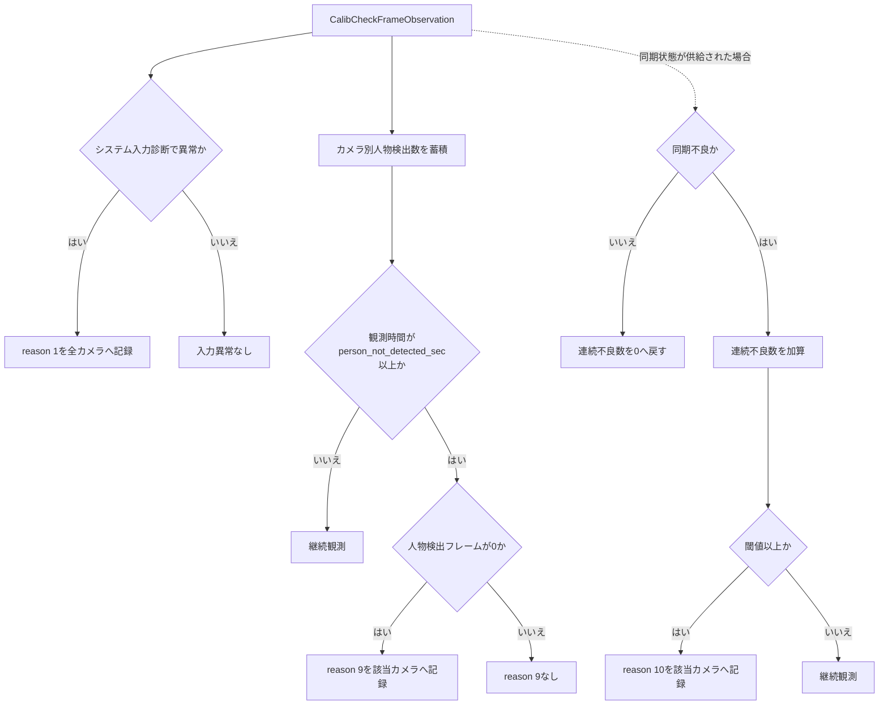

#### ログ・追跡: reason 2～5

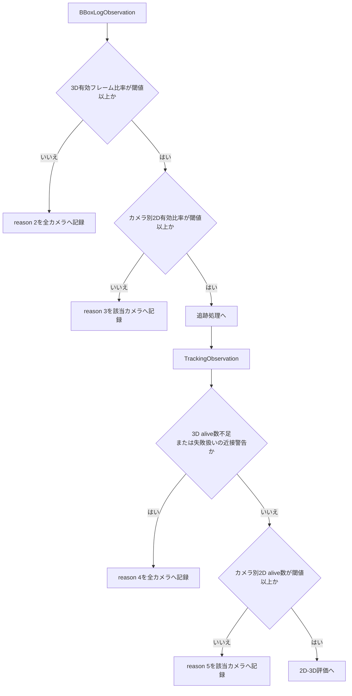

#### 評価・統計・判定: reason 6～8・10・11

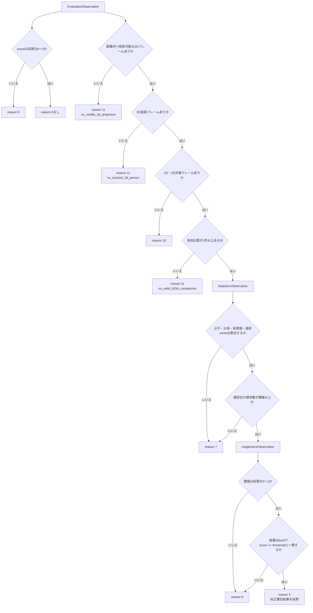

reason 10または11が成立したカメラは統計・判定の前提が成立しないため、reason 7・8を
重複して付けない。reason 6が成立する不正scoreについても、判定不整合をreason 8として重ねない。
bboxログまたは追跡段階ですでに評価不能となったカメラには、後段評価がreason 10・11を
返しても診断findingとして追加しない。

## 11. シーケンス図

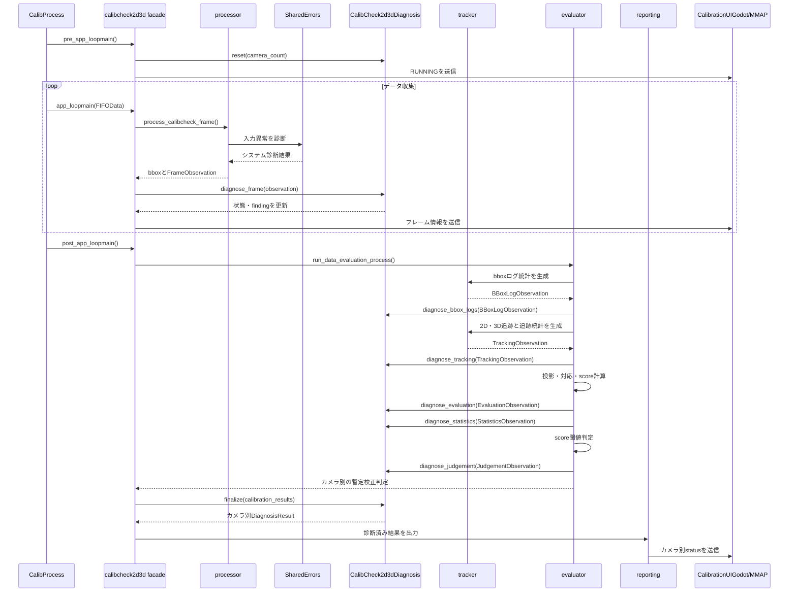

## 12. 複数理由と代表理由

従来の `merge_reason_codes()` の代わりに、現在は次の規則を使う。

1. 検出した理由をすべて `CalibCheckFinding` として保存する。
2. 同じカメラ・同じ理由は最初の1件だけを保持し、毎フレーム追加しない。
3. UIと結果ファイルには代表理由を一つ出す。
4. 代表理由の優先順位はコード上の呼び出し順ではなく、定義テーブルで決める。

実装済みの優先グループは次のとおりである。

1. 入力または同期を信頼できない: reason 1、10
2. 原因が明確な人物未検出: reason 9
3. ログまたは追跡が成立しない: reason 2、3、4、5
4. センサ間で評価可能な人物が対応しない: reason 11
5. 評価、統計、最終判定が成立しない: reason 6、7、8

reason 3と9は同時に成立しやすい。カメラの人物検出ゼロが継続したことを確認できる場合は、
汎用的な「2D bboxログ不正」より具体的なreason 9を代表理由にする。

### 12.1 findingの記録からUI出力まで

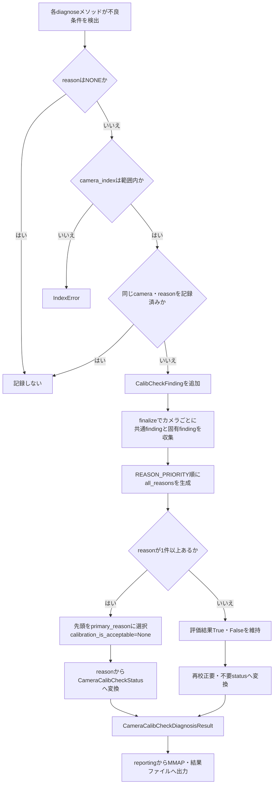

### 12.2 代表理由の優先順位

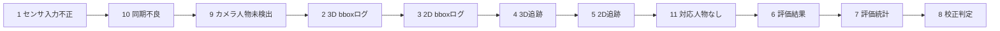

左側ほど優先度が高い。`camera_index=None`のfindingは全カメラへ適用し、カメラ固有findingと
合わせて同じ優先表で代表理由を決める。

## 13. システム診断との関係

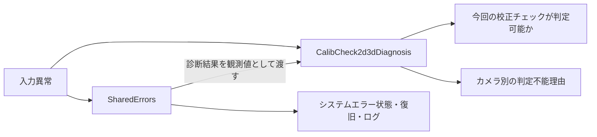

実際には入力を二重評価せず、`SharedErrors` の結果を次のように渡す。

```python
frame_observation = CalibCheckFrameObservation(
    system_input_error_detected=input_error_detected,
    camera_detection_counts=detection_counts,
    synchronization_valid=synchronization_observation,
)
diagnosis.diagnose_frame(frame_observation)
```

システムエラーが回復しても、校正チェックの収集データが十分でなければ、そのセッションの
判定不能理由は残る場合がある。システムエラーの現在状態と、診断セッションの成立性は別々に扱う。

## 14. reportingの境界

`reporting.py` は、診断ロジックを持たない出力アダプタとする。

```python
def publish_camera_calibcheck_statuses(
    results: Sequence[CameraCalibCheckDiagnosisResult],
    *,
    set_status: Callable[[int, CameraCalibCheckStatus], None],
) -> None: ...

def write_calibcheck_result_files(
    resultfiles: Sequence[str],
    results: Sequence[CameraCalibCheckDiagnosisResult],
    *,
    logger: object,
) -> None: ...
```

文言変換が出力に必要な場合も、`reporting.py` 独自の辞書を持たず、診断モジュールが公開する
関数または診断結果のプロパティを使用する。

## 15. 導入段階と現在位置

定義集約、型付き診断結果、収集後診断、ループ中診断の枠組み、評価・統計・判定診断まで
導入済みである。現在は次を運用データで調整する段階にある。

1. 実機データを使った各閾値の妥当性確認
2. reason 10のループ中診断へ同期判定値を供給する接続
3. 複数reasonが同時成立する場合の優先順位の運用確認
4. reason 1および追跡異常の追加条件
5. UI表示、結果ファイル、ログの現地確認

## 16. テスト方針

### 既存動作の回帰確認

既存テストを回帰基準として記録し、診断変更後に同じテストを実行する。
reason判定を意図的に変更したケースを除き、既存の期待値を変更してテストを通してはならない。

回帰確認では、少なくとも次を比較する。

- 各段階へ渡される画像、点群、2D/3D bboxの形状と値
- bboxログ件数とカメラ別の記録内容
- 2D/3D追跡の選別結果
- 投影結果、評価対象フレーム、評価score、統計値
- reason 0のカメラに対する校正要否判定
- MMAPへ設定するライフサイクル、カメラ別ステータス、送信順
- 結果ファイルの `OK`、`NG`、`Unknown`
- 既存の校正関連設定の読み込み結果

対象を絞った基本コマンドは次とする。

```bash
source .venv/bin/activate
python -m pytest -q \
    tests/test_calibcheck2d3d_*.py \
    tests/test_calibration_calibcheck_status_integration.py \
    tests/test_calibration_contracts.py \
    tests/test_app_config_calibration.py
```

共通診断との接続を変更した段階では、校正とファイル入出力に関する次のテストも実行する。

```bash
source .venv/bin/activate
python -m pytest -q \
    tests/test_calib_process_error_handling.py \
    tests/test_calib_wait_file_io_error.py \
    tests/test_calibration2d3d_file_io_error.py \
    tests/test_calibration3d3d_file_io_error.py \
    tests/test_data_capture_file_io_error.py \
    tests/test_file_io_error_diagnosis.py
```

TensorRTエンジンやキャッシュの生成、実モデルを使う長時間推論、実機・UIアプリの起動は、
この診断構造変更の通常の回帰テストには含めない。YOLO境界は既存のmockまたはstubを使う。
`pyproject.toml` にはslowテストを一括除外するpytest markerが現時点で定義されていないため、
通常確認では上記のようにテストファイルを明示して実行する。

### 定義と変換

- reason 0～11が重複せず定義されている。
- 各reasonが期待する表示文言とUIステータスへ変換される。
- `FORBIDDEN` や未定義値を通常結果として書き込めない。

### ループ中診断

- 単発の未検出ではreason 9を確定しない。
- 規定時間以上観測して人物検出が一度もない場合、該当カメラだけreason 9になる。
- 規定時間内に一度でも人物を検出した場合、途中の未検出が長くてもreason 9にならない。
- 絶対時刻の変更や巻き戻りがreason 9の経過時間判定へ影響しない。
- 同期不良の一時発生と継続発生を区別できる。
- システム入力診断の結果がreason 1の観測へ反映される。

### 収集後診断

- 3D共通異常が全カメラへ反映される。
- 2D異常が該当カメラだけへ反映される。
- ログ、追跡、評価、統計、判定の各段階を独立して診断できる。
- 途中で評価不能になっても、先に記録したfindingが残る。

### 複数理由

- 全理由が保持される。
- 代表理由が処理の呼び出し順に依存しない。
- reason 3と9が同時に成立した場合、仕様で定めた優先結果になる。

### reporting

- reportingがreasonを再判定しない。
- `True`、`False`、`None` がそれぞれ `OK`、`NG`、`Unknown` へ出力される。
- 3カメラの結果が互いに混ざらない。

## 17. 今後の調整項目

- reason 1を確定する入力異常の継続回数または割合
- reason 4、5で異常に多い追跡対象を判定する上限
- reason 10のループ中診断へ渡す同期判定値と連続回数設定
- reason 11で将来、最低対応数または対応率を要求するか
- 実装済みの代表理由優先順位がUI表示仕様と現地運用に合うか

reason 6はscoreの型・有限性・範囲、reason 7は統計内訳・標本数・選択scoreの整合、
reason 8は閾値・結果型・再計算結果との一致として実装済みである。

## 18. 実装状況

以下の枠組みを導入済みである。

- reason 0～11、表示文言、UIステータス集約表を
  `calibcheck2d3d_result_diagnosis.py` に集約
- 実行単位の `CalibCheck2d3dDiagnosis` と、フレーム、bboxログ、追跡、評価、
  統計、最終判定の観測型を追加
- `pre_app_loopmain()` で診断状態を初期化し、`app_loopmain()` で入力異常と
  カメラ検出数を記録
- 収集後の評価フローから各段階の診断メソッドを呼び、最後にカメラ別の
  `CameraCalibCheckDiagnosisResult` を生成
- evaluatorからUI通知、結果ファイル出力までを
  `list[CameraCalibCheckDiagnosisResult]` で統一
- 旧ステータス名称、`CameraCalibCheckStatusDiagnosis`、reporting内のreason変換辞書を削除し、
  正式な変換関数と型付き結果を直接使用
- `reporting.py` のreason文言とUI集約表は、診断モジュールの正式定義を参照
- reason 2～5のログ・追跡件数、比率、閾値をdetailsへ記録
- reason 6～8の評価出力、統計内訳、最終判定の整合性診断を実装
- reason 10の共通フレーム診断と、reason 11の投影不能・有効比較なしの詳細分類を実装

reason 9は単調増加時計による10秒以上の観測を条件とし、その間に人物を一度も検出しなかった
カメラについて`finalize()`で確定する。画像内へ投影可能な3D対象がない場合はreason 11として
扱う。reason 10の後処理診断はフレーム番号の共通要素で判断するため、絶対時刻を使用しない。
ループ中の連続同期不良診断は受け口まで実装済みだが、実運用経路から同期判定値をまだ渡していない。
