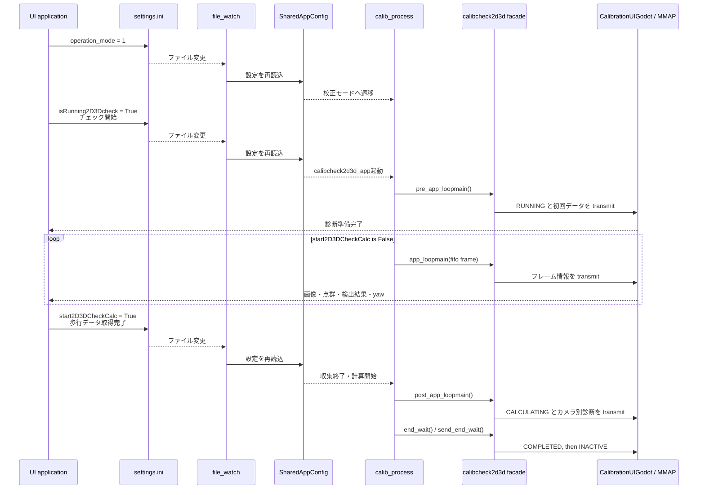
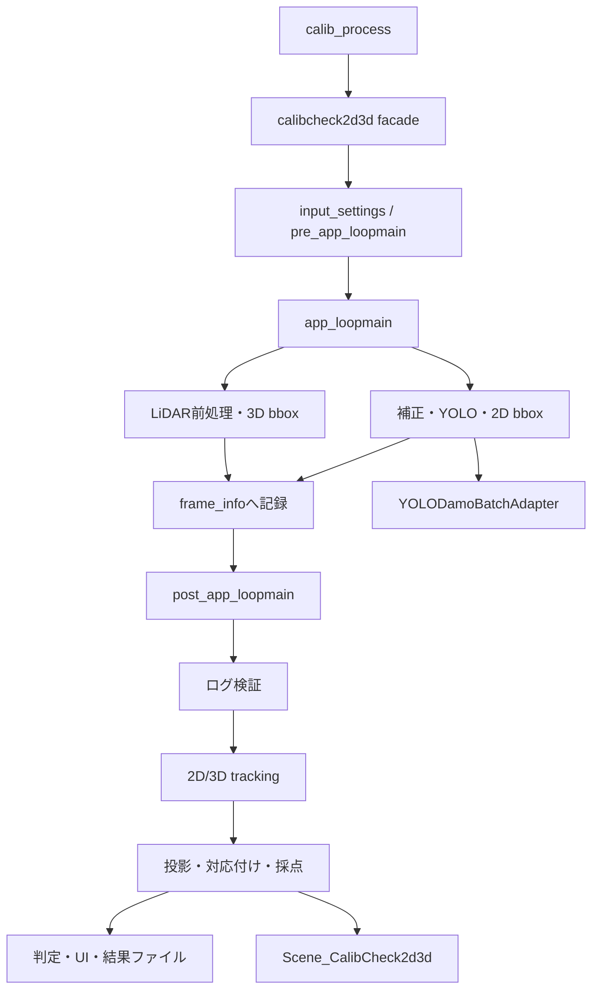
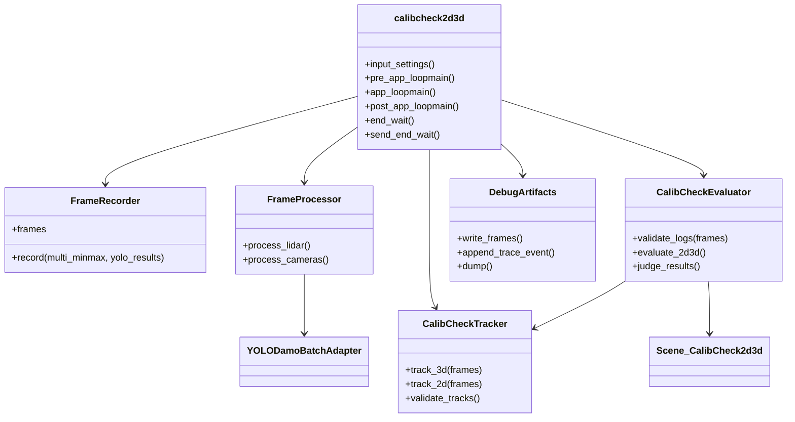

# calibcheck2d3d リファクタリング設計図

## 目的と前提

対象は `argus_synchro/calibration_mat_generator_modules/ctrl/calibcheck2d3d` の
`__init__.py`（約 3,200 行）である。目的は振る舞いを変えずに責務を分け、以後の
変更時に処理差分をテストで追跡できる構造にすること。

- 現在の `main` を唯一の動作基準とする。既存の `refactor/calibcheck2d3d` は実装の
  参照元にしない。
- `SceneDesc.py` と `YOLOadapter.py` は原則として変更しない。
- 外部 API の `calibcheck2d3d`、そのライフサイクルメソッド、既存の import 経路は維持する。
- TensorRT の生成・モデル再作成はテスト対象外とし、YOLO は adapter 境界でスタブ化する。
- コンポーネント間で `__dict__` を共有しない。状態と依存関係はコンストラクタ引数、
  引数、戻り値で明示する。
- `types.py` は移設初期の仮置きとする。型が少数のままなら、最終段階で依存方向を崩さない
    既存の utility モジュールへ統合するかを見直す。型を循環 import の回避だけのために残さない。
- 移設元のコメントのうち、アルゴリズムの意図、データ形式、閾値の理由、外部 I/F の制約、
    将来の検討事項は対応する処理塊へ残す。移設でそのまま位置を保てない場合は、重複させずに
    意味の最も近い関数またはクラスの直前へ再配置する。

## UI・設定ファイルとの外部プロトコル

このモジュールは内部計算だけで完結しない。core アプリは
`./argus_bootfig_jetson.sh appimage` で起動され、`MonitorArgus.json` が指定する UI と
`[CalibUI_IF]` の MMAP を介して連携する。UI はユーザー操作に応じて `settings.ini` の
`[General]`と`[CalibMode]`を書き換える。`file_watch`が変更を検出して`SharedAppConfig`へ
反映し、coreは共有設定からその変更を読む。

ユーザーが校正チェック開始ボタンを押したとき、UIは`isRunning2D3Dcheck=True`を設定する。
これが`calibcheck2d3d_app()`への遷移条件であり、coreは`pre_app_loopmain()`を1回実行した
直後から`app_loopmain()`によるデータ収集を開始する。`pre_app_loopmain()`は画面待機中に
継続する処理ではない。

`calib_process.py` が `start2D3DCheckCalc` を監視し、`False` の間だけ
`app_loopmain()` を呼ぶ。`True` になると loop を抜け、`post_app_loopmain()` を一度だけ
実行する。この制御は `calibcheck2d3d` の外側にあるため、refactor 後も lifecycle method の
呼び出し回数、戻り値、例外の意味を変更してはいけない。



MMAP への物理的な書き込みは `CalibrationUIGodot.transmit_setdata()` に集約されている。
内部コンポーネントは `CalibrationUIGodot` を保持せず、画像・点群・検出結果・評価結果を
値として facade に返す。facade のみが、既存と同じタイミングで `set_*()` と
`transmit_setdata()` を呼ぶ。MMAP の割り当ては
`config/calibration_mat_generator_modules/mmap_assign.json` と `[CalibUI_IF]` が契約元であり、
本リファクタリングでアドレスや送信バッファの形を変更しない。

カメラ別の最終結果は、校正不要、校正必要、判定不能のいずれかを MMAP に書く。判定不能では
理由コードを保持し、`CameraCalibCheckStatusDiagnosis` による既存の UI status 変換を維持する。
理由コードを単一の全体エラーへ畳み込まない。

## 現状の処理



外部からは `calib_process.py` が `pre_app_loopmain()`、`app_loopmain()`、
`post_app_loopmain()` を呼ぶ。従って、この三つと`end_wait()`、
`send_end_wait()` は facade に残す。これらは UI と設定ファイルの状態遷移を表す public protocol
であり、単なる orchestration helper ではない。

## 責務の分割案



### 1. 明示的なデータ型

最初に新設する `types.py` は、以下の既存 `TypedDict` と、`frame_info` の暗黙の
タプル構造を名前付きの不変データに置き換える。

```python
@dataclass(frozen=True)
class RecordedFrame:
    yolo_results: list[list[NDArray[np.generic]]]
    lidar_minmax: NDArray[np.float64]
```

合わせて `VirtualBBoxDebugCounts`、`EvaluationMetricDebug`、
`TrackProximityWarning` を移す。互換性のため、入口モジュールからは従来どおり再 export
する。`RecordedFrame` 導入時はまず access helper を置き、全ての直接添字アクセスを同一
変更で置換する。旧タプルと新型を混在させない。

### 2. Tracker recorder

現在 `__init__.py` にある `calibcheck2d_bboxtracker_recorder` と
`calibcheck3d_bboxtracker_recorder` は `tracker_recorder.py` へ、ロジックを変えずに
移す。クラス名と入口からの export は維持する。

この段階では共通基底クラスを作らない。2D/3D の tracker 設定、入力形式、描画結果は異なる
ため、共通化は重複が明確になってから別変更で判断する。

### 3. Tracking とログ検証

`tracker.py` に次を移す。

- `track_3dbbox()` / `track_2dbbox()`
- 2D/3D の選別・妥当性検証
- `_detect_close_3dbbox_tracks()`

このクラスは `RecordedFrame` と設定を受け取り、tracking interface と理由コードを返す。
結果を facade の属性へ暗黙保存しない。近接警告は戻り値または `TrackingOutcome` に含める。

### 4. 幾何評価

`evaluator.py` に次を移す。

- `project_3dbbox_core()`
- bbox 縮小、中心差、2D 交差の helper
- `evaluate_bbox_overlap_scenedesc()`
- `evaluate_2d3d()` と `judge_calibration_result()`

投影に必要な `rtvec_mat`、intrinsics、画像サイズ、scene、幾何定数は evaluator の
コンストラクタで受ける。評価のデバッグ結果は `EvaluationOutcome` として返す。
`Scene_CalibCheck2d3d` の実装は移動のみの新規モジュールにしてもよいが、`SceneDesc.py`
自体は変更しない。

### 5. フレーム処理とデバッグ

最後に `processor.py` に次を移す。

- `proc_lidar1f()` / `proc_camera1f()` と monitor 更新 helper
- 静的点フィルタの状態管理
- `input_data_diagnosis()`

デバッグ動画、pickle、trace は `debug_artifacts.py` にまとめる。デバッグ有効時だけ書き込み、
評価・フレーム処理の判定結果には影響しないことを契約にする。

### 5.1 `debuginfo_and_functions.py` の改名と分離

`debuginfo_and_functions.py` は名前と内容が一致していない。現在は次の三種を同居させている。

| 分類 | 現在の関数・クラス | 扱い |
| --- | --- | --- |
| 計算処理 | `conbine3d3d`、`internal_make_BB`、`read_rtvec`、`conv_intarr` | 本処理の依存。副作用と入出力を固定して保持する。 |
| debug 2D 描画 | `draw_singlebbox`、`draw_multibbox` | 開発時の画像オーバーレイ専用。製品 UI の描画ではない。 |
| debug 3D 表示 | `vis_viewer` | Open3D の開発支援専用。 |

製品 UI は core が `CalibrationUIGodot` を通じて MMAP に書いた画像、点群、YOLO bbox 座標を受け、
UI 側で描画する。したがって、`draw_*` と `vis_viewer` の有無や呼び出しは、MMAP の画像・bbox
データ、評価結果、状態遷移を変更してはならない。

初回の変更は、内容を変えずに `calibcheck_utils.py` へ改名する。旧ファイルは re-export の互換層
として残し、`wait_app` を含む外部 import を段階的に新名へ更新する。`wait_app` も
`conbine3d3d` と `read_rtvec` を利用しているため、この二つを debug 専用モジュールへ移してはならない。

改名後の分割は、実利用とテストが安定してから次の形を検討する。

```text
calibcheck_utils.py      # LiDAR結合、bbox構築、rtvec読込、座標変換
calibcheck_debug_draw.py # draw_singlebbox、draw_multibbox
calibcheck_debug_view.py # vis_viewer
debuginfo_and_functions.py  # 旧 import 用の re-export のみ
```

この分割は必須ではない。`calibcheck_utils.py` が十分小さく、Open3D/Matplotlib の import を通常経路へ
持ち込むことが問題にならないなら、改名と docstring の明確化だけで完了してよい。

### 6. facade の責務

facade は状態遷移と MMAP 公開を担当する。`pre_app_loopmain()`、`app_loopmain()`、
`post_app_loopmain()` 内の具体的な計算は processor / tracker / evaluator に委譲してよいが、
次は facade に残す。

- `CalibrationCommonStatus` の `RUNNING`、`CALCULATING`、`COMPLETED`、`INACTIVE` への遷移
- `set_dummydata()`、`set_camera_calibcheck_status()`、`transmit_setdata()` の呼び出し順
- `debug_index` と `ref_t` の対応
- カメラごとの理由コードから UI status への変換
- 結果ファイルの出力と debug artifact の終了処理

## 状態と所有者

| 状態 | 現状の問題 | 分割後の所有者 |
| --- | --- | --- |
| `frame_info` | タプル位置に依存した直接アクセス | `FrameRecorder` |
| `rtvec_mat` と intrinsics | 初期化順が暗黙 | `CalibCheckEvaluator` の不変依存 |
| 2D/3D tracker のログ・metadata | facade と recorder の責務が混在 | tracker recorder と `CalibCheckTracker` |
| 静的点フィルタと `pointfilter_lastadd` | セッション境界が不明瞭 | `FrameProcessor` |
| 評価 metric と仮想 bbox 統計 | facade に副作用として蓄積 | `EvaluationOutcome` |
| debug 動画・trace | 本処理の分岐に混在 | `DebugArtifacts` |
| UI status と MMAP 送信順 | 計算処理と混在 | facade（移動しない） |
| `CalibMode` の遷移監視 | `calib_process` が制御 | `calib_process`（変更しない） |

最も危険な境界は `frame_info`、初期化された calibration 行列、カメラごとの理由コードである。
これらを移す変更では、戻り値の順序、カメラ数、理由コードをテストで固定する。

## テスト戦略

現時点で `.venv/bin/python -m pytest -q tests/test_calibcheck2d3d_*.py` は
`56 passed`。既存テストはログ検証、投影、評価、tracker 検証、終了時の UI 状態を対象にする。

移設前に次の回帰テストを追加する。これは実装のテストではなく、現行の振る舞いを固定する
ためのもの。

1. `app_loopmain()` が LiDAR、camera、描画、記録、debug video、UI transmit を現在の順で呼ぶ。
2. `data_evaluation_process()` で記録時、追跡時、評価時の理由コードがカメラ単位で合流し、
   既存の失敗理由を後段が上書きしない。
3. 一部カメラに失敗があっても他カメラの評価を継続し、全カメラ不能時のみ全体不能となる。
4. `create_for_evaluation()` と通常初期化の evaluator 入力が同じ形になる。
5. 2D と 3D tracker の閾値が独立して適用される。
6. debug の on/off が評価スコア、理由コード、frame 記録を変えない。
7. `draw_multibbox()` と `vis_viewer` を無効化しても、MMAP に渡す画像、YOLO bbox 座標、点群、
    `ref_t` は変わらない。
8. `pre_app_loopmain()` は `RUNNING` を初回 MMAP 送信より先に設定する。
9. `app_loopmain()` は 1 フレームにつき 1 回だけ MMAP を送信し、その `ref_t` は送信後に
    増える `debug_index` と対応する。
10. `post_app_loopmain()` は `CALCULATING` を設定後、全カメラの診断 status を MMAP 送信前に
    設定する。理由コードがあるカメラは、評価 boolean が何であっても判定不能 status になる。
11. `end_wait()` と `send_end_wait()` はそれぞれ `COMPLETED` と `INACTIVE` を MMAP に送る。
12. `calib_process` 側で `start2D3DCheckCalc` が `True` にならない限り、`post_app_loopmain()` は
     呼ばれない。

各段階では、移設した単位のテストに加え、必ず既存の対象全体を実行する。

```bash
source .venv/bin/activate
python -m pytest -q tests/test_calibcheck2d3d_*.py
```

最後に TensorRT を生成しない範囲で `tests/` 全体を実行する。モデル実行が必要な処理は
adapter をモックして検証する。

## 実施順序と判断点

| 段階 | 変更 | 合格条件 | 次へ進む判断 |
| --- | --- | --- | --- |
| 0 | 回帰テストを追加 | 現行で全件 pass | 失敗を再現できる |
| 1 | 型・定数の移動と再 export | 対象全体 pass | import/API 不変 |
| 2 | tracker recorder の移動 | tracking 関連 + 対象全体 pass | tracker 出力不変 |
| 3 | tracker とログ検証の移動 | 理由コード回帰 + 対象全体 pass | カメラ単位の結果不変 |
| 4 | evaluator の移動 | 投影・評価 + 対象全体 pass | score/reason 不変 |
| 5 | utility の改名と互換層 | `wait_app` を含む import 回帰 + 対象全体 pass | 通常処理の依存不変 |
| 6 | frame processor と debug の移動 | ライフサイクル/MMAP 回帰 + 対象全体 pass | 呼出順・送信内容不変 |
| 7 | facade を薄くする | 全体テスト pass | 外部 API 不変 |

各段階を別コミット相当の小さな差分にする。テストが失敗したら次の抽出には進まず、当該段階の
入出力・状態所有を修正する。これにより、全体結合時の差分がどの移設で発生したかを特定できる。

## 今回は決めないこと

- 2D/3D tracker の共通基底化
- Scene の判定ポリシーや YOLO adapter の仕様変更
- 閾値の設定ファイル化
- `debuginfo_and_functions.py` の計算処理を debug 専用として削除すること
- TensorRT・ONNX・実機カメラを使う性能検証

## 旧 `dataproc()` 経路の扱い

静的検索では `calibcheck2d3d.dataproc()` の呼び出し元は見つからず、通常の
2D-3D calibcheck は `calib_process.py` から `app_loopmain()` を通る。
このため旧`dataproc()`と、その経路だけが使用していた`calibcheck_detection_2d3d.py`を削除した。
旧処理を別ファイルへ退避せず、現行経路で必要な処理は既存の`processor.py`、`evaluator.py`、
`debug_artifacts.py`にある実装をそのまま使用する。

静的点群フィルタは `dataproc()` 専用ではない。通常経路の `app_loopmain()` から
`proc_lidar1f()` を経由しても適用されるため、旧経路の退避・削除時に現行フィルタを
削除してはならない。

## 実施記録（2026-09-17 - 2026-09-18）

### 保存した外部契約

- core - UI 間の lifecycle は facade に残した。`pre_app_loopmain()`、
    `app_loopmain()`、`post_app_loopmain()`、`end_wait()`、`send_end_wait()` の
    public API、呼出順、MMAP 送信時点を変更していない。
- `pre_app_loopmain()` は `RUNNING`、dummy 値、初回 MMAP 送信の順を維持する。
- 通常の 1 フレームは、入力診断、yaw、LiDAR、camera/YOLO、debug 描画、bbox 記録、
    debug video、MMAP 送信の順を維持する。
- `post_app_loopmain()` は `CALCULATING` を設定し、カメラ別の診断 status を設定してから
    MMAP を送信する。結果ファイル出力は MMAP 送信後に行う。
- `end_wait()` / `send_end_wait()` はそれぞれ `COMPLETED` / `INACTIVE` を dummy 値と
    ともに MMAP へ送信する。
- 既存の日本語コメントは、移設先の対応する処理塊へ可能な限り保持した。新しい説明も
    日本語で記述する。

### 分離済みの責務

| モジュール | 分離した責務 | facade 側に残したもの |
| --- | --- | --- |
| `types.py` | 評価・追跡の TypedDict | 既存 import 経路への再 export |
| `tracker_recorder.py` | 2D/3D tracker の状態記録 | recorder の既存クラス名 |
| `tracker.py` | bbox ログ、再走査、選別、近接警告、reason 2/3/4/5 | 既存メソッド名の互換ラッパー |
| `evaluator.py` | 投影、bbox 幾何、Scene 重なり、score/reason 選択、評価 orchestration | `evaluate_2d3d()` の中心ループ |
| `processor.py` | 設定読込、入力診断、静的点フィルタ、LiDAR/camera 1 フレーム処理、UI 用データ整形 | monitor を使う最終公開と lifecycle |
| `scene_calibcheck2d3d.py` | `Scene_CalibCheck2d3d` 派生クラス | `SceneDesc.py` 自体は未変更 |
| `debug_artifacts.py` | trace、pickle、debug video、debug 3D bbox 描画 | debug 有効判定と lifecycle 上の呼出時点 |
| `reason_codes.py` | reason の文言・UI 番号・カメラ status 変換 | MMAP 送信 |
| `result_artifacts.py` | カメラ別結果ファイル、評価点群 debug ファイル | post の状態遷移と送信順 |
| `lifecycle.py` | 終了状態の dummy 値付き MMAP 公開 | public lifecycle classmethod |

`__init__.py` は開始時点の約 3,180 行から 1,851 行まで削減した。削減率は約 42% である。

### 追加した回帰テスト

- `pre_app_loopmain()` の `RUNNING`、dummy、初回 MMAP 送信順。
- `app_loopmain()` の LiDAR、camera、描画、記録、video、MMAP 送信順。
- `send_end_wait()` の `INACTIVE` MMAP 送信。
- カメラ別の `Unknown` / `OK` / `NG` 結果ファイル。
- 2D/3D tracker の再走査順、選択 camera、画像サイズ。
- YOLO 座標から UI/MMAP 用 bbox 座標への変換。
- LiDAR 点群の列数別 UI データ整形。
- 可視 3D フレームの stride サンプリングと最後の可視フレームの保持。
- 複数カメラの score、reason、metric が独立すること。

対象テストは最後に次のコマンドで `65 passed` を確認した。

```bash
source .venv/bin/activate
python -m pytest -q tests/test_calibcheck2d3d_*.py
```

加えて、編集対象の静的診断と `git diff --check` は通過している。

### 保留中の作業

1. `evaluator.py` へ `evaluate_2d3d()` の中心ループを完全移設する。
     現在は公開入口・周辺 helper・評価 orchestration を移したが、loop 本体は facade の
     `_evaluate_2d3d_impl()` に残る。trace、score、reason 9/10/11、virtual bbox 統計を
     既存テストで維持しながら移す。
2. `debuginfo_and_functions.py` の最終整理を行う。
     現在は本処理の `conbine3d3d`、`internal_make_BB`、`read_rtvec` と、debug 描画・
     Open3D 表示が混在している。`wait_app` も前者を利用するため、計算処理を debug 専用として
     削除しない。名称変更・互換 re-export・描画の分離は後段で判断する。
3. 分割済み module の import と type hint を整理し、対象外を含む test suite を実行する。
     TensorRT の再作成や実機 YOLO 推論を必要とする処理は、adapter をモックする。

これらは振る舞い保存の分割が完了し、回帰テストで基準を固定してから個別に判断する。
