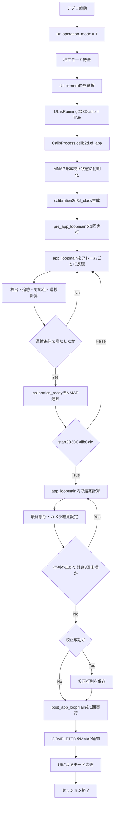
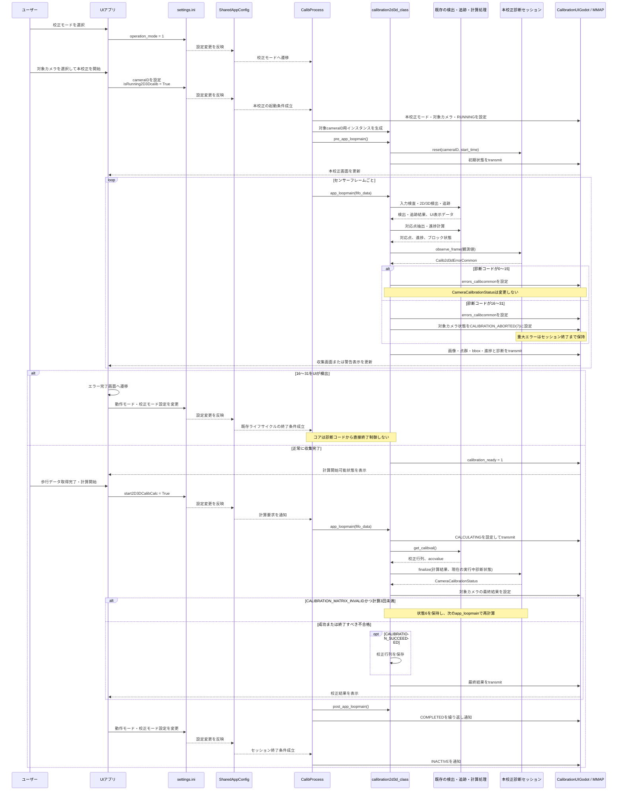
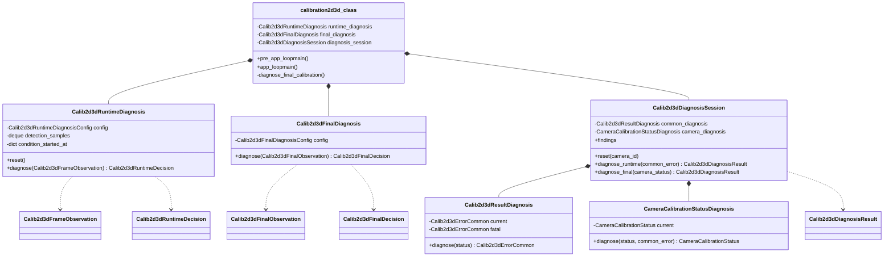

# calibration2d3d システムフロー・診断機構 設計

## 1. 目的

本資料は、新しいカメラ-LiDAR校正パラメータを生成する本校正機能
`calibration2d3d`について、現在のシステムフローと診断機構の設計方針を整理する。

`calibration2d3d`は、既存校正状態の日常チェックを行う`calibcheck2d3d`とは独立した機能である。
本資料では`calibcheck2d3d`のreason定義、全カメラ集約、OK/NG/Unknown判定を本校正へ流用しない。
ただし、計算処理と診断判断の分離、診断セッションによる履歴保持などの設計原則は参考にする。

本設計では、既存の`calibration2d3d`のライフサイクルを大きく変更せず、
診断に関係する処理だけを独立したモジュールとして追加している。

## 2. 機能の位置づけ

| 機能 | 目的 | 実行単位 | 結果 |
|---|---|---|---|
| `calibration2d3d` | 新しいカメラ-LiDAR校正行列を求める | カメラ1台・校正1回 | 校正行列、カメラ別校正結果 |
| `calibcheck2d3d` | 既存校正状態を日常的に確認する | 複数カメラを含むチェック1回 | カメラ別の校正要否チェック結果 |

本校正では、ユーザーがUIで対象カメラを選択する。全カメラを必ず校正するのではなく、
1台だけ校正することもできる。複数台を校正する場合も、1台のセッションを完了した後、
次の`cameraID`で新しいセッションを開始する。

## 3. UI・設定・コアの連携

UIアプリはユーザー操作に応じて`settings.ini`を変更する。変更はコア側の設定監視を経由して
`SharedAppConfig`へ反映され、`CalibProcess`が校正モードと本校正処理を制御する。

主要な設定値は次のとおりである。

| 設定値 | コア側での意味 |
|---|---|
| `General.operation_mode = 1` | システムを校正モードへ移行する |
| `CalibMode.cameraID` | 今回校正するカメラを指定する |
| `CalibMode.isRunning2D3Dcalib = True` | 選択カメラの本校正セッションを開始する |
| `CalibMode.start2D3DCalibCalc = False` | フレーム収集、追跡、対応点生成、進捗計算を継続する |
| `CalibMode.start2D3DCalibCalc = True` | 進捗条件を満たした場合、最終校正計算を開始する |

対象カメラに依存する検出器、追跡器、設定、入力経路などは
`calibration2d3d_class`生成時に初期化される。そのため通常の操作順は、
`cameraID`を確定してから`isRunning2D3Dcalib=True`とする。

## 4. 現在の実装フロー

### 4.1 全体フロー



### 4.2 相互作用図（UI・診断・MMAPを含む）



図中の実行中診断、16～31のラッチ、`CALIBRATION_ABORTED(7)`への変換、最終診断、
および行列不正時の最大3回計算は実装済みである。既存行列との差分は算出して最終診断へ
渡しているが、`enable_reference_matrix_difference=False`のため現在は成功可否へ反映しない。
また、設定変更の検出・共有設定への反映に関する内部実装の詳細は省略し、
UIからコアへ状態が反映される論理的な経路として表している。

### 4.3 `pre_app_loopmain()`

`pre_app_loopmain()`は1回限りの初期化処理であり、UI操作を待つ継続ループではない。

主な処理は次のとおりである。

- ループ回数、進捗値、開始時刻の初期化
- 入力終端状態の初期化
- `status_calibcommon = RUNNING`の設定と初回MMAP送信
- 最終2D/3D対応点のクリア
- ファイル入力自動終了状態の初期化
- 対象`cameraID`の保存

診断機構の導入後は、ここで対象カメラ用の診断セッションも初期化する。

### 4.4 `app_loopmain()`の収集部分

`app_loopmain()`はFIFOから渡された1フレーム分のデータを処理する。収集部分では主に次を行う。

1. カメラ、LiDAR、CAN入力の検査
2. 2D人検出・追跡
3. 3D人検出・追跡
4. UI表示用画像、点群、bboxの生成
5. 2D/3D対応点の抽出
6. 歩行範囲と進捗の計算
7. ブロック・サブブロック進捗のMMAP通知
8. 最終計算を開始できるかの判定

通常運用では、収集部分から最終計算部分へ進むために次の両方が必要である。

```text
current_progress_score > progress_score
start2D3DCalibCalc = True
```

進捗不足の状態で`start2D3DCalibCalc=True`になった場合、現在の実装は計算要求を無視して
収集処理を継続する。ファイル入力自動終了デバッグ経路では、この条件に例外がある。

### 4.5 `app_loopmain()`の最終計算部分

現在の実装では、最終校正計算は`post_app_loopmain()`ではなく`app_loopmain()`内で行われる。

主な処理は次のとおりである。

1. `status_calibcommon = CALCULATING`をMMAPへ通知
2. `get_calibval()`による校正行列計算
3. 精度値`accvalue`の取得
4. 精度条件の判定
5. 成功時の校正行列CSV保存
6. 対象カメラの`CameraCalibrationStatus`更新
7. フレームループ終了

### 4.6 `post_app_loopmain()`と終了通知

現在の`post_app_loopmain()`は実質的な最終計算を行わず、ほぼ空の後処理である。
その後、`end_wait()`が`COMPLETED`をMMAPへ通知し、UIによるモード変更を待つ。
終了時は`send_end_wait()`が`INACTIVE`を通知する。

## 5. MMAPへ出力する診断の区分

本校正では、異なるMMAP領域へ出力する2種類の診断を扱う。

| 診断 | 対象 | 主な判定時期 | 用途 |
|---|---|---|---|
| `Calib2d3dErrorCommon` | 現在実行中の校正セッション | `app_loopmain()`の収集中 | 作業条件、検出、追跡などの状態をUIへ随時通知 |
| `CameraCalibrationStatus` | 対象カメラの最終結果 | `app_loopmain()`の最終計算時、または重大エラー確定時 | カメラ別校正結果をUIへ通知 |

コアは診断コードに基づいて画面遷移や動作モード変更を行わない。
コアがMMAPへ診断コードを書き、UIアプリがそれを検出して次を行う。

- 警告またはエラー内容の表示
- 必要な場合のエラー完了画面への強制遷移
- `settings.ini`の動作モード・校正モード設定の変更

コアはUIによる設定変更を既存経路で検出し、現在のライフサイクルを終了する。
したがって、診断結果に`can_continue`のようなコア制御用フラグは設けない。

## 6. `Calib2d3dErrorCommon`の設計

### 6.1 コード区分

現在の定義では、コードの範囲に次の意味がある。

| 範囲 | 意味 | コア側の動作 |
|---|---|---|
| 0 | デフォルト | MMAPへ現在値を通知する |
| 1～15 | 校正処理を継続できる警告 | MMAPへ通知する。コアはループを強制終了しない |
| 16～31 | 校正継続不能としてUIをエラー完了へ導く理由 | MMAPへ通知する。画面遷移とモード変更はUIが行う |

現在定義済みの理由は次のとおりである。

| 値 | 名前 | 意味 |
|---:|---|---|
| 0 | `DEFAULT` | デフォルト |
| 1 | `CALIBRATION_SUCCEEDED` | 校正成功 |
| 2 | `WALKING_RANGE_INVALID` | 歩行範囲が不適切 |
| 3 | `WALKING_PERSON_COUNT_INVALID` | 歩行人数が不適切 |
| 4 | `POOR_PERSON_DETECTION` | 人検知不良 |
| 5 | `POOR_TRACKING_3D` | 3D側の追跡不具合 |
| 6 | `POOR_TRACKING_2D` | 2D側の追跡不具合 |
| 7 | `UNSUITABLE_CONDITION` | 撮影条件が校正に不適切 |
| 16 | `LONG_DURATION_CALIBRATION` | 校正作業が長時間化 |
| 17 | `PERSON_DETECTION_IMPOSSIBLE` | 人検知不能 |
| 18 | `TRACKING_IMPOSSIBLE` | 追跡不能 |

### 6.2 判定と通知

診断モジュールはフレーム処理で得られた観測値を受け取り、現在UIへ通知すべき
`Calib2d3dErrorCommon`を返す。MMAP操作は行わない。

```text
既存処理が観測値を生成
  ↓
診断セッションが観測値と履歴を更新
  ↓
Calib2d3dErrorCommonを決定
  ↓
calibration2d3d_classがset_errors_calibcommonを呼ぶ
  ↓
既存のtransmit_setdataでMMAPへ送信
```

診断専用のMMAP送信を原則として追加せず、既存のフレーム通知へ同乗させる。

### 6.3 重大エラーの保持

16～31を一度検出した場合は、UIが確実に読み取れるよう、対象セッション終了まで
診断コードを保持する。後続フレームで一時的に正常な観測値が得られても`DEFAULT`へ戻さない。

0～15は現在状態として扱う。警告の成立条件が解消した場合は`DEFAULT`へ戻し、
過去に一度成立したという理由だけでは最終結果へ引き継がない。

## 7. `CameraCalibrationStatus`の設計

### 7.1 コード定義

予約値7を実行中の重大エラーによる校正中断へ割り当てた。

| 値 | 名前 | 意味 |
|---:|---|---|
| 0 | `DEFAULT` | 計算結果確定前 |
| 1 | `CALIBRATION_SUCCEEDED` | 校正成功 |
| 2 | `POOR_SENSOR_CORRESPONDENCE` | 複数センサの対応付け不良 |
| 3 | `WALKING_PERSON_COUNT_INVALID` | 歩行人数が不適切 |
| 4 | `POOR_TRACKING_3D` | 3D側の追跡不具合 |
| 5 | `POOR_TRACKING_2D` | 2D側の追跡不具合 |
| 6 | `CALIBRATION_MATRIX_INVALID` | 校正行列データ不正 |
| 7 | `CALIBRATION_ABORTED` | `Calib2d3dErrorCommon`の16～31により校正を完了せず中断 |

値7は個別の原因を表さない。UIは具体的な中断理由を`errors_calibcommon`から取得する。

### 7.2 重大エラーとの連動

`Calib2d3dErrorCommon`が16～31になった場合、同じMMAP送信前に対象カメラの状態を7へ設定する。

```text
errors_calibcommon = 16～31の具体的な理由
camera_calibration_status[cameraID] = CALIBRATION_ABORTED
  ↓
同一のtransmit_setdataでUIへ通知
```

0～15の警告では`CameraCalibrationStatus`を7へ変更しない。また、他カメラの結果を変更しない。

### 7.3 最終計算結果

正常に最終計算へ到達した場合は、生成された校正行列を正として対象カメラの最終状態を決める。
収集中の0～15の警告が計算開始時点で残っていても、行列・精度・既存行列との差が正常なら
最終状態1 `CALIBRATION_SUCCEEDED`とする。16～31は一度成立した時点でセッション終了まで
保持し、最終状態7を優先する。

判定の概念例は次のとおりである。

```text
行列shape、有限値、精度、既存行列との差のいずれかが不正
  → CALIBRATION_MATRIX_INVALID

上記がすべて正常
  → CALIBRATION_SUCCEEDED
```

最終状態2～5は定義として残すが、現在の最終判定では0～15の実行中警告から直接変換しない。
行列不正時の原因調査には、実行中コードと最終診断の`details`を利用する。

## 8. 診断セッション

### 8.1 単位とライフサイクル

診断セッションの単位は「カメラ1台・本校正1回」とする。

```text
pre_app_loopmain
  → cameraIDを指定して診断セッションを初期化

app_loopmainの収集部分
  → フレーム観測を記録
  → 実行中診断を更新
  → Calib2d3dErrorCommonを返す

app_loopmainの最終計算部分
  → 行列・精度・既存行列との差からCameraCalibrationStatusを確定
  → 0～15は成功を妨げず、ラッチ済みの16～31だけを状態7へ反映

セッション終了
  → 次のcameraIDでは新しい診断セッションを開始
```

### 8.2 保持する情報

診断処理は、MMAPへ公開する代表コードとは別に次の状態を保持する。

- 対象`cameraID`
- `app_loopmain()`開始時刻と経過時間
- 診断条件ごとの連続開始時刻
- 直近20秒の2D検出成否
- 直近20秒の2D・3D追跡成否
- 最新の2D検出数、3D bbox数、2D・3D追跡ID数
- セッション中に発生した診断理由を記録する`findings`
- 現在UIへ公開する0～15の診断コード
- セッション終了まで保持する16～31の重大エラー
- 対象カメラの最終結果
- 行列不正時の計算試行回数。カメラごとの開始時に0へ戻す

総処理フレーム数や累積検出数など、現在の判定に使わない統計は保持していない。

診断コードだけでなく、後続のログ出力に利用できる`Calib2d3dFinding`を保持する。
findingには対象カメラ、検出フェーズ、共通診断コードまたはカメラ別状態、説明文、
判定根拠となった詳細値を記録する。同一フェーズ・同一診断の所見はセッション中に1件だけ保持し、
フレームループ中に同じ診断が続いても履歴が無制限に増えない構造とする。

主な診断フェーズは次のとおりである。

- フレーム入力
- 人検知
- 3D追跡
- 2D追跡
- 進捗判定
- 最終計算
- 校正行列検証

`details`には、検出数、追跡フレーム数、必要閾値、対応点数、進捗値、精度値、
行列検証結果など、その診断を後から説明するために必要な値を格納する。
診断モジュールはログ出力自体を必須責務とせず、ログ出力側がfindingを参照できるようにする。

## 9. 診断モジュールの責務境界

診断モジュールが担当することは次のとおりである。

- 観測値と履歴の保持
- `Calib2d3dErrorCommon`の判定
- 重大エラーの保持
- 行列・精度・既存行列との差による`CameraCalibrationStatus`の判定
- 複数理由が成立した場合の代表理由選択

診断モジュールが担当しないことは次のとおりである。

- 画像処理、人検出、2D/3D追跡
- 対応点生成、進捗計算、校正行列計算
- MMAPの直接操作
- UI画面遷移
- `settings.ini`の書き換え
- コア処理の強制終了
- `isRunning2D3Dcalib`や`operation_mode`の変更

## 10. 診断データ構造

実装時は、処理クラスの内部属性を診断モジュールが直接参照せず、診断用の観測型を介する。

```python
@dataclass(frozen=True, slots=True)
class Calib2d3dFrameObservation:
    image: NDArray[np.uint8] | None
    detection_2d_count: int
    bbox_3d_count: int
    tracking_2d_id_count: int
    tracking_3d_id_count: int
    bbox_3d_centers_xy: tuple[tuple[float, float], ...] = ()
```

```python
@dataclass(frozen=True, slots=True)
class Calib2d3dFinalObservation:
    matrix: NDArray[np.floating]
    accuracy_value: float
    accuracy_threshold: float
    accuracy_check_enabled: bool
    poor_sensor_correspondence: bool = False
    invalid_person_count: bool = False
    poor_tracking_3d: bool = False
    poor_tracking_2d: bool = False
    reference_matrix_difference_invalid: bool | None = None
```

フレーム観測値には既存処理の配列を加工せず、件数、中心座標、入力画像への参照を渡す。
最終観測値には計算済み行列、精度値、既存行列との差分判定、および原因調査用として
計算開始時点で成立している0～15の診断状態から作ったフラグを渡す。

診断クラスの構成は次のとおりである。

```text
Calib2d3dRuntimeDiagnosis
  ├─ reset()
  └─ diagnose(frame_observation)

Calib2d3dFinalDiagnosis
  └─ diagnose(final_observation)

Calib2d3dDiagnosisSession
  ├─ reset(camera_id)
  ├─ diagnose_runtime(common_error)
  └─ diagnose_final(camera_status)

Calib2d3dResultDiagnosis
  └─ 実行中のCalib2d3dErrorCommonを判定

CameraCalibrationStatusDiagnosis
  └─ 最終CameraCalibrationStatusを判定
```

`Calib2d3dDiagnosisSession`が`Calib2d3dResultDiagnosis`と
`CameraCalibrationStatusDiagnosis`を束ね、MMAPへ渡す代表値と所見を管理する。

### 10.1 クラス図

実行中の時系列診断だけを`calib2d3d_runtime_diagnosis.py`へ分離し、診断コード、
最終診断、診断セッションは`calib2d3d_result_diagnosis.py`へ集約する。
`calibration2d3d_class`は観測値の組み立てとMMAP反映を担当し、判定ロジックを持たない。



## 11. 組み込み位置

大きな構造変更を避ける場合の組み込み位置は次のとおりである。

### 11.1 初期化

`calibration2d3d_class.__init__()`で診断器を生成し、`pre_app_loopmain()`で対象カメラ用にリセットする。

### 11.2 収集中

`dataproc()`、対応点抽出、進捗計算から得た観測値を診断セッションへ渡す。
診断結果を`monitor.set_errors_calibcommon()`へ設定してから、既存のMMAP送信を行う。

### 11.3 重大エラー時

実行中診断が16～31になった場合、同じ送信前に対象カメラの
`CameraCalibrationStatus`を7へ設定する。コアは診断を理由に直接ループ終了しない。

### 11.4 最終計算時

`get_calibval()`と精度評価後に最終診断を呼び、対象カメラの状態を設定する。
最終診断では、0～15の実行中警告は成功可否に使わない。行列・精度・既存行列との差が
正常なら成功とする。セッション中に一度でも成立した16～31だけは、ラッチ済みの理由として
状態7へ反映する。
最終診断が不合格の場合は、その状態を保持して収集ループを終了し、UIの結果画面へ進む。
ただし、値6 `CALIBRATION_MATRIX_INVALID` の場合だけは一時的な計算失敗を考慮し、
初回を含む最大3回まで計算する。3回目も不合格なら値6を保持して終了する。

### 11.5 終了時

`post_app_loopmain()`では、必要に応じて診断セッションの終了状態を確定する。
現在の最終計算位置を`post_app_loopmain()`へ移動することは、本設計の必須条件としない。

## 12. 実装状態

次の項目は実装済みである。

- 実行中診断、最終診断、診断セッションの分離
- カメラごとの診断状態リセット
- 歩行範囲、人数、人検出率、2D・3D追跡率、暗所、長時間、検出不能、追跡不能の判定
- 診断ごとのコード上のON/OFFフラグ
- 0～15の回復時解除と、16～31のセッション内ラッチ
- 16～31と対象カメラ状態7の同時通知
- 行列shape、有限値、精度値による最終診断
- 既存行列との差（回転10度、並進0.5）の算出と最終診断への入力。判定は既定OFF
- 最終不合格時の結果画面への遷移と、行列不正時だけの最大3回計算
- カメラ別・機種別の歩行範囲設定
- 既存の収集・対応付け・校正行列生成処理を変更しない構造

次の項目は未接続またはスタブである。

- 最終状態2～5を行列不正の原因別結果として使い分ける判定
- 既存行列との差分判定の有効化。実装済みだが現在は既定OFF
- `Calib2d3dErrorCommon.CALIBRATION_SUCCEEDED`の通知
- 実機値に基づく暫定閾値と機種別歩行範囲座標の確定

## 13. テスト方針

最低限、次を確認する。

1. `pre_app_loopmain()`でカメラごとの診断状態がリセットされる。
2. 1～15の診断では対象カメラの最終状態を7にしない。
3. 16～31の診断では、同じMMAP送信前に対象カメラ状態を7にする。
4. 重大エラーが後続フレームで`DEFAULT`へ戻らない。
5. 他カメラの`CameraCalibrationStatus`を変更しない。
6. 診断モジュールがMMAPや`settings.ini`を直接操作しない。
7. 診断追加前後で既存の収集、進捗、計算、行列保存順序が変わらない。
8. 最終計算成功時に対象カメラが`CALIBRATION_SUCCEEDED`となる。
9. 計算開始時点で0～15が成立中でも、行列診断が正常なら最終結果1になる。
10. 一度成立した16～31が後続フレームで解除されず、最終状態7へ反映される。
11. 同じ診断コードが継続しても、ログが毎フレーム過剰出力されない。
12. 複数カメラを順番に校正した場合、診断セッションが混在しない。
13. ファイル入力自動終了経路でも、通常経路と同じ診断結果規則を使用する。
14. 行列不正と0～15が同時成立した場合、最終状態6が優先される。
15. `CALIBRATION_MATRIX_INVALID`では初回を含む3回だけ計算し、3回目も不合格なら状態6で終了する。
16. 既存行列との差分判定は既定OFFで成功可否を変えず、明示的にONにした場合だけ閾値超過を状態6とする。参照値を読めない場合は推測で不合格にしない。
17. 歩行範囲設定がカメラ番号0始まりで読み込まれ、8要素以外を拒否する。
18. 機種別校正設定に全カメラ分の歩行範囲が存在する。

## 14. 未確定事項

今後、UI仕様または実データで次を確認する必要がある。

- `CameraCalibrationStatus`の値7の正式名称とUI表示文言
- 重大エラーと`start2D3DCalibCalc=True`が同時に成立した場合の正式な表示優先順位
- `CALIBRATION_SUCCEEDED`を`Calib2d3dErrorCommon`にも設定する必要があるか
- 次カメラ開始時に、前カメラの`CameraCalibrationStatus`を保持するMMAP契約
- 検出率・追跡率20%と輝度20.0が実機データに対して妥当か
- 2D追跡ID数を人数の主判定に使う仕様を、3D情報で補完する必要があるか
- 最終状態2～5を将来、行列不正の原因表示として使い分ける必要があるか
- 既存校正行列との差分閾値（現在は回転10度、並進0.5固定）の機種別設定化が必要か
- 画像全チャンネルの単純平均を輝度とする現在方式に、色順や対象領域の考慮が必要か

これらは既存コードから推測して決めず、UI仕様および本校正仕様と整合させて確定する。

## 15. 診断コード別の観測値・実装状態

### 15.1 調査方針

本節は、現在の本校正処理から取得できる観測値、実装済みの診断条件、
および今後確定が必要な仕様を整理したものである。

既存の校正結果を変えないため、次を原則とする。

- 既存処理が校正対象選択や計算可否に使っている判定値は変更しない。
- 診断のために既存の配列をフィルタリング、並べ替え、加工しない。
- 診断には既存結果の件数・状態・統計値のコピーを渡す。
- 暫定閾値は診断専用設定として分離し、実データ確認後に調整できるようにする。
- 「実装済み」と「将来拡張・スタブ」を区別する。

調査結果の分類は次のとおりである。

| 分類 | 意味 |
|---|---|
| A | 診断条件と通知処理を実装済み |
| B | 観測または一部処理はあるが、最終判定へ未接続またはスタブ |
| C | 診断理由または必要な観測値が未定義 |

### 15.2 `Calib2d3dErrorCommon`

| 値・名前 | 診断入力 | 現在の実装 | 今後の確認事項 | 分類 |
|---|---|---|---|---|
| 0 `DEFAULT` | 診断セッションの現在状態 | 0～15の成立条件が解消したフレームで現在値を`DEFAULT`へ戻す。16～31成立後は戻さない | なし | A |
| 1 `CALIBRATION_SUCCEEDED` | `transmat`、`accvalue`、行列保存完了 | カメラ最終状態1は設定するが、共通診断領域の成功1は現在設定しない | 共通診断領域にも成功1を設定する必要があるか | B |
| 2 `WALKING_RANGE_INVALID` | 3D bbox中心とカメラ別四隅 | 1点でも境界上または範囲外の状態が20秒連続すると成立し、全点が内部へ戻れば即解除。`walking_area_enabled=False`では無効 | 機種・カメラ別の実座標 | A |
| 3 `WALKING_PERSON_COUNT_INVALID` | 2D検出数、3D bbox数、2D/3D追跡ID数 | 2D追跡ID数を主判定に使い、0人は値17側で扱う。1人以外が20秒連続すると成立し、1人へ戻れば即解除 | 3D情報を補助判定へ使う必要性 | A |
| 4 `POOR_PERSON_DETECTION` | フレームごとの2D検出有無 | 開始20秒後から、直近20秒の検出成功率が20%未満なら成立。値17を優先する | 20%の実機妥当性 | A |
| 5 `POOR_TRACKING_3D` | 3D bbox有無と3D追跡ID有無 | 開始20秒後から、直近20秒の追跡成功率が20%未満なら成立。3D bboxがないフレームは率を悪化させない。値18と値5を値6より優先する | 20%の実機妥当性 | A |
| 6 `POOR_TRACKING_2D` | 2D検出有無と2D追跡ID有無 | 開始20秒後から、直近20秒の追跡成功率が20%未満なら成立。2D未検出フレームは率を悪化させない。値18・値5を優先する | 20%の実機妥当性 | A |
| 7 `UNSUITABLE_CONDITION` | 16画素おきにサンプリングした入力画像の全チャンネル平均 | 平均輝度20.0未満が20秒連続すると成立し、閾値以上へ戻れば即解除 | 色順、対象領域、閾値の実機妥当性 | A |
| 16 `LONG_DURATION_CALIBRATION` | 診断専用の単調増加時計 | `app_loopmain()`開始から600秒で成立し、セッション終了まで保持 | なし | A |
| 17 `PERSON_DETECTION_IMPOSSIBLE` | 2D検出有無 | 2D未検出が20秒連続すると成立し、値4より優先してセッション終了まで保持 | なし | A |
| 18 `TRACKING_IMPOSSIBLE` | 2D/3Dの検出有無と追跡ID有無 | 検出あり・追跡IDなしが2Dまたは3Dの片側で20秒連続すると成立し、値5・6より優先して保持 | なし | A |
| 19～31 予約 | 未定 | なし | UI仕様とともに理由を定義する | C |

### 15.3 `CameraCalibrationStatus`

| 値・名前 | 診断入力 | 現在の実装 | 今後の確認事項 | 分類 |
|---|---|---|---|---|
| 0 `DEFAULT` | 最終結果未確定状態 | カメラごとの校正開始時に設定 | なし | A |
| 1 `CALIBRATION_SUCCEEDED` | `transmat`、`accvalue`、精度検査設定 | 行列shapeが`(4, 4)`、全要素が有限値であり、精度検査無効または`accvalue < threshold`なら行列を保存して成功1とする | なし | A |
| 2 `POOR_SENSOR_CORRESPONDENCE` | 原因調査用の対応点情報 | 現在の最終判定では設定しない | 将来、行列不正の原因別表示として使うか | B |
| 3 `WALKING_PERSON_COUNT_INVALID` | 原因調査用の実行中コード3 | 現在の最終判定では設定しない。複数人警告中でも行列診断が正常なら成功1とする | 将来、行列不正の原因別表示として使うか | B |
| 4 `POOR_TRACKING_3D` | 原因調査用の実行中コード5 | 現在の最終判定では設定しない | 将来、行列不正の原因別表示として使うか | B |
| 5 `POOR_TRACKING_2D` | 原因調査用の実行中コード6 | 現在の最終判定では設定しない | 将来、行列不正の原因別表示として使うか | B |
| 6 `CALIBRATION_MATRIX_INVALID` | `transmat`のshape・有限値、`accvalue`、既存行列との差分 | shape不正、非有限値、または有効な精度検査の不合格で値6とする。0～15より優先し、最大3回計算後も不正なら値6で終了。既存行列との差は入力するが既定OFF | 差分判定の有効化と閾値の設定ファイル化 | A |
| 7 `CALIBRATION_ABORTED` | ラッチ済みの`Calib2d3dErrorCommon` | 共通診断16～31から7へ変換する処理は実装済み | UIが同一MMAP送信で両値を読む契約の実機確認 | A |

### 15.4 既存設定値とそのまま利用できる統計

| 領域 | 既存設定・統計 | 現在の用途 | 診断details候補 |
|---|---|---|---|
| 2D検出 | `conf_thresh`、`nms_thresh`、フィルタ後bbox・score | YOLO検出とbbox選別 | 検出数、最大score、正score数、フィルタ前後件数 |
| 2D追跡 | `bbox_tracking_framelen_min`、`bbox_tracking_movelen_pixels`、`bbox_tracking_workarea2d_count` | alive track判定 | 総track数、alive数、target数、各trackの期間・移動量・領域内回数 |
| 3D検出 | 点群数、DBSCAN後bbox数、フィルタ後bbox数 | 3D bbox生成 | 入力点数、bbox数、空bbox継続数 |
| 3D追跡 | `bbox_tracking_framelen_min`、`bbox_tracking_movelen_meters`、`bbox_tracking_workarea3d_count` | alive track判定 | 総track数、alive数、target数、各trackの期間・移動量・領域内回数 |
| 歩行範囲 | `progress_threshold`、ブロック定義JSON、`progress_idmap` | 計算開始可否とUI進捗 | 現在・最大score、不足group、ブロック・サブブロック充足数 |
| 対応付け | 2D/3D timestamp、同期後配列 | 共通timestampによる対応点生成 | 同期前件数、共通timestamp数、同期率、同期後対応点数 |
| 精度 | `CalcAccuracy.check_enable`、`CalcAccuracy.accvalue`、LOOCV結果 | 行列保存可否 | `accvalue`、閾値、検査有効フラグ、評価点数 |
| 行列 | `transmat`、既存行列との差分ログ | CSV保存とデバッグ | shape、有限値、回転行列指標、並進量、既存値との差分 |

### 15.5 調査で確認した注意点

1. 既存の`track_main.tracking_diagnosis()`はダミーのままである。今回の実行中追跡診断は、
   既存追跡処理を変更せず`Calib2d3dRuntimeDiagnosis`で独立して行う。
2. 2D trackerの`lastframe_person_detected`は毎フレーム更新されるが、3D trackerの同名値は
   初期化のみで更新されない。3D検出診断にはbbox数やtracker出力数を使う必要がある。
3. `get_last_singleyoloBB()`は単一検出を前提に深い添字で取得するため、人数診断の正式入力には
   向かない。YOLO出力全体またはフィルタ後の有効score数を使う方が安全である。
4. `current_progress_score`は既存の計算開始可否そのものであり利用価値が高いが、収集中に低いことは
   通常状態でもある。時間条件や計算要求なしで即座にコード2へしてはいけない。
5. `starttime`は`app_loopmain()`末尾の処理時間計測で更新されるため、長時間校正判定には
   診断セッション専用の単調増加時計が必要である。
6. 対応点はcenter、axis、範囲フィルタ後finalの複数段階に存在する。
   最終状態2 `POOR_SENSOR_CORRESPONDENCE`の正式判定段階を決める必要がある。
7. `accvalue`は小さいほど良く、現在の成功条件は厳密な`<`である。診断追加時に`<=`へ変更しない。
8. 現在の`CalcAccuracy.check_enable=False`では、`accvalue`にかかわらず成功として保存する。
   診断追加によってこの既存契約を暗黙に変更してはならない。
9. 既存の校正行列差分チェックは、回転10度・並進0.5を閾値として結果を最終診断へ渡す。
   `enable_reference_matrix_difference=False`のため現在は値6へ反映しない。
   参照ファイルを読めない場合は判定不能としてログ警告を出し、この条件だけで不合格にはしない。

### 15.6 実装済み判定と残る調整項目

以下は現在接続済みの判定条件と、実機確認後に調整する項目である。

1. `errors_calibcommon`の値2を出すタイミング（判定周期は決定済み）
   - 収集中に毎フレーム判定する。
   - 計算開始要求時だけの判定にはしない。
   - 一定時間進捗が増えないことは判定条件に含めない。
   - 想定とは異なる範囲を歩いている状態を対象とする。
   - 歩行範囲は、パラメータでカメラごとに四隅を規定する。
   - 設定名は`walking_area_corners_camera0`から始め、カメラ番号は0始まりとする。
   - 設定値は`[x0,y0,x1,y1,x2,y2,x3,y3]`形式とし、機種別校正設定ファイルに記載する。
   - 四隅から定まる領域の境界線上は範囲外として扱う。
   - 範囲外が20秒継続した場合に値2を通知する。
   - 正常範囲へ戻ったフレームで値2を即座に解除する。
2. `errors_calibcommon`の値3の人数定義
   - 2D追跡ID数を主な人数判定に使用し、期待人数は1人とする。
   - 診断関数には2D検出数、3D bbox数、2D追跡ID数、3D追跡ID数をすべて入力し、補助判定とdetails記録に利用できる形にする。
   - 1フレームの観測だけでは成立させず、異常が20秒継続した場合に成立させる。
   - 20秒の途中で1人へ戻った場合は継続時間を0から数え直す。
3. `errors_calibcommon`の値4と17の境界（使用する指標は決定済み）
   - 検出率と連続未検出時間の両方を判定に使う。
   - 1フレームの未検出だけでは成立させない。
   - 暫定値として、直近20秒の有効検出率が20%未満なら値4とする。
   - 連続未検出が20秒に達した場合は値17とし、値4より優先する。
   - 検出率20%は誤警報を抑える安全側の初期値であり、実データ確認後に見直す。
4. `errors_calibcommon`の値5・6と18の境界
   - 値5は3D側、値6は2D側をそれぞれ独立に判定する。
   - 値5と6が同時成立した場合は値5を優先する。
   - 値5・6は、それぞれ直近20秒の追跡成功率が20%未満の場合に成立させる。
   - 値18は、検出があるのに追跡IDがない状態が片側で20秒連続した場合に成立させる。
5. `errors_calibcommon`の値7の撮影条件
   - まず入力画像が異常に暗いことを判定対象とする。
   - 全ヒストグラムは生成せず、縦横16画素おきに間引いた画像の全チャンネル平均を使う。
   - 平均輝度20.0未満を暗所とする。
   - 暗い状態が20秒継続した場合に値7とする。
   - 閾値、対象領域、色順を考慮した輝度変換は実機確認後の調整項目とする。
6. `errors_calibcommon`の値16の時間（決定済み）
   - `app_loopmain()`開始からの経過時間を診断専用の単調増加時計で観測する。
   - 10分を閾値とする。
   - カメラごとの校正開始時に時計をリセットする。
7. `CameraCalibrationStatus`の最終判定
   - 行列診断が正常なら、0～15の状態にかかわらず値1とする。
   - 行列診断が不正なら値6を最優先する。
   - 値2～5は現在の最終判定では設定せず、原因調査用情報を`details`へ残す。
8. 精度検査不合格時の`CameraCalibrationStatus`（決定済み）
   - 値6 `CALIBRATION_MATRIX_INVALID`とする。
9. 行列不正の範囲
   - shapeが`(4, 4)`でない場合と非有限値を正式な異常条件にする。
   - 有効な精度検査で`accvalue < threshold`を満たさない場合も値6とする。
   - 初回を含む最大3回計算し、3回目も不正なら値6のまま結果画面へ進む。
   - 既存行列との差が回転10度または並進0.5を超えたかを観測するが、現在は判定OFFとする。
   - 参照値を読み出せない場合は差分判定をスキップし、他の行列条件で判定する。

### 15.7 診断設定

診断固有の閾値は、`calib_settings.ini`の`[Calib2d3d_Diagnosis]`へ分離している。

現在の設定は次のとおりである。

- 歩行範囲外の成立時間。初期値は20秒
- 人数不適切の連続時間は20秒、期待人数は1人
- 人検出率の評価期間は20秒、暫定閾値は20%
- 連続未検出時間。初期値は20秒
- 2D・3D追跡率の評価期間は20秒、暫定閾値は20%
- 追跡不能へ移る継続時間。初期値は20秒
- 暗所判定の連続時間は20秒、輝度閾値は20.0、画素間引き幅は16
- 長時間校正の閾値。初期値は600秒
- カメラ別歩行範囲と診断有効フラグ`walking_area_enabled`

`continuation_seconds=20.0`は歩行範囲、人数、暗所、連続未検出、連続追跡不能で共用する。
検出率・追跡率は`detection_rate_window_seconds=20.0`の時間窓と
`detection_rate_threshold=0.2`の下限値を共用する。値16は600秒とする。
率の20%は安全側の暫定値として設定し、実データで確認後に調整する。
歩行範囲座標は機種別校正設定ファイルで上書きする。現在の座標値は仮値であり、
`walking_area_enabled=False`を既定として実座標確定前には診断を成立させない。
既存行列との差分閾値は現在コード上で回転10度・並進0.5としているが、
`enable_reference_matrix_difference=False`のため最終結果への反映は無効である。

### 15.8 診断ごとの有効・無効切り替え

各診断は、診断設定オブジェクトの個別フラグで独立してON/OFFできる。
このフラグは当面`calib_settings.ini`へ公開せず、コード上の設定として保持する。
無効にした診断は、継続時間の履歴を成立させず、他の診断結果にも影響を与えない。

実行中診断には次のフラグを設けている。

- 歩行範囲不適切
- 歩行人数不適切
- 人検知不良
- 3D追跡不良
- 2D追跡不良
- 撮影条件不適切
- 長時間校正
- 人検知不能
- 追跡不能

最終診断には次のフラグを設けている。

- 行列shape検証
- 行列有限値検証
- 精度検査
- 既存行列との差分検証。実装済みだが現在はOFF
